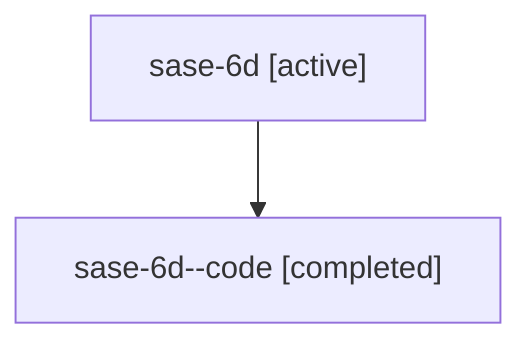

# Family: sase-6d

[Agent Hoods](../README.md) / [bbugyi200](../users/bbugyi200/README.md) / [athena](../users/bbugyi200/machines/athena/README.md) / [sase-6d](../users/bbugyi200/machines/athena/hoods/sase-6d/README.md) / sase-6d

Owner: `bbugyi200.athena` · Hood: `sase-6d` · Members: 2

## Lineage

The diagram is an optional enhancement; the ordered table below contains the same lineage in accessible text.

| Role | Agent | State | Model / provider | Timing | Commits | Prompt | Chat |
|---|---|---|---|---|---:|---|---|
| root | sase-6d | active | gpt-5.6-sol / codex | 2026-07-16T20:34:19.220895+00:00 | [2](../agents/bbugyi200.athena.sase-6d/README.md#commits) | [Prompt](../agents/bbugyi200.athena.sase-6d/prompt.md) | [Chat](../agents/bbugyi200.athena.sase-6d/chat.md) |
| code | sase-6d--code | completed | gpt-5.6-sol / codex | 2026-07-16T20:51:36.067611+00:00 | [2](../agents/bbugyi200.athena.sase-6d--code/README.md#commits) | — | [Chat](../agents/bbugyi200.athena.sase-6d--code/chat.md) |

## Commits

| Role | Commit | Subject | Committed (UTC) |
|---|---|---|---|
| code | [`aa38ebf`](https://github.com/sase-org/sase/commit/aa38ebf34fc2be9484d5b06f2c79c05a4e062725) | refactor!: remove unused content layout entry points (sase-6d) | 2026-07-16 21:11:11 |
| root | [`aa38ebf`](https://github.com/sase-org/sase/commit/aa38ebf34fc2be9484d5b06f2c79c05a4e062725) | refactor!: remove unused content layout entry points (sase-6d) | 2026-07-16 21:11:11 |
| code | [`50809bd`](https://github.com/sase-org/sase/commit/50809bdb85382fe20e9e502e2f14b15c37490728) | test: stabilize xprompt save visual snapshots (sase-6d) | 2026-07-16 21:11:46 |
| root | [`50809bd`](https://github.com/sase-org/sase/commit/50809bdb85382fe20e9e502e2f14b15c37490728) | test: stabilize xprompt save visual snapshots (sase-6d) | 2026-07-16 21:11:46 |

## Neighbors

| Agent | Relation | State |
|---|---|---|
| [sase-6d.1](../agents/bbugyi200.athena.sase-6d.1/README.md) | descendant | active |
| [sase-6d.2](../agents/bbugyi200.athena.sase-6d.2/README.md) | descendant | active |
| [sase-6d.3](../agents/bbugyi200.athena.sase-6d.3/README.md) | descendant | active |
| [sase-6d.4](../agents/bbugyi200.athena.sase-6d.4/README.md) | descendant | active |
| [sase-6d.5](../agents/bbugyi200.athena.sase-6d.5/README.md) | descendant | active |
| [sase-6d.6](../agents/bbugyi200.athena.sase-6d.6/README.md) | descendant | active |
| [sase-6d.7](bbugyi200.athena.sase-6d.7.md) (family · 2) | descendant | active 1, completed 1 |
| [sase-6d.8](../agents/bbugyi200.athena.sase-6d.8/README.md) | descendant | active |
| [sase-6d.8.f0](../agents/bbugyi200.athena.sase-6d.8.f0/README.md) | descendant | active |
| [sase-6d.9](../agents/bbugyi200.athena.sase-6d.9/README.md) | descendant | active |
