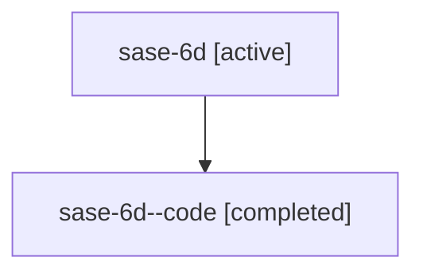

# Family: sase-6d

Owner: `bbugyi200.athena` · Hood: `sase-6d` · Members: 2

## Lineage

The diagram is an optional enhancement; the ordered table below contains the same lineage in accessible text.

| Role | Agent | State | Model / provider | Timing | Commits | Prompt | Chat |
|---|---|---|---|---|---:|---|---|
| root | sase-6d | active | gpt-5.6-sol / codex | 2026-07-16T20:34:19.220895+00:00 | 2 | [Prompt](../agents/bbugyi200.athena.sase-6d/prompt.md) | [Chat](../agents/bbugyi200.athena.sase-6d/chat.md) |
| code | sase-6d--code | completed | gpt-5.6-sol / codex | 2026-07-16T20:51:36.067611+00:00 | 2 | — | [Chat](../agents/bbugyi200.athena.sase-6d--code/chat.md) |
