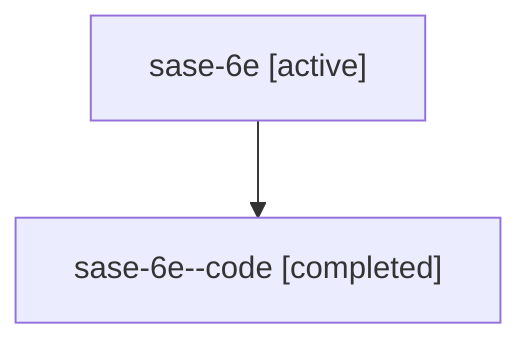

# Family: sase-6e

[Agent Hoods](../README.md) / [bbugyi200](../users/bbugyi200/README.md) / [athena](../users/bbugyi200/machines/athena/README.md) / [sase-6e](../users/bbugyi200/machines/athena/hoods/sase-6e/README.md) / sase-6e

Owner: `bbugyi200.athena` · Hood: `sase-6e` · Members: 2 · Bead: [sase-6e](https://github.com/sase-org/sase--beads/blob/main/pages/sase-6e/README.md)

## Lineage

The diagram is an optional enhancement; the ordered table below contains the same lineage in accessible text.

| Role | Agent | State | Model / provider | Timing | Commits | Prompt | Chat |
|---|---|---|---|---|---:|---|---|
| root | sase-6e | active | gpt-5.6-sol / codex | 2026-07-16T23:40:54.892761+00:00 | 0 | [Prompt](../agents/bbugyi200.athena.sase-6e/prompt.md) | [Chat](../agents/bbugyi200.athena.sase-6e/chat.md) |
| code | sase-6e--code | completed | gpt-5.6-sol / codex | 2026-07-16T23:54:00.403045+00:00 | [1](../agents/bbugyi200.athena.sase-6e--code/README.md#commits) | — | [Chat](../agents/bbugyi200.athena.sase-6e--code/chat.md) |

## Commits

| Role | Repo | Commit | Subject | Committed |
|---|---|---|---|---|
| code | sase | [`a0dc62d`](https://github.com/sase-org/sase/commit/a0dc62d2fa5788eb06a5e60a7be14976c2f09eb5) | feat(notification-gates): finalize adapter-owned auto resolution (sase-6e) | 2026-07-16 20:25:16 EDT |

## Neighbors

| Agent | Relation | State |
|---|---|---|
| [sase-6e.1](../agents/bbugyi200.athena.sase-6e.1/README.md) | descendant | active |
| [sase-6e.2](../agents/bbugyi200.athena.sase-6e.2/README.md) | descendant | active |
| [sase-6e.3](../agents/bbugyi200.athena.sase-6e.3/README.md) | descendant | active |
| [sase-6e.4](../agents/bbugyi200.athena.sase-6e.4/README.md) | descendant | active |
| [sase-6e.5](../agents/bbugyi200.athena.sase-6e.5/README.md) | descendant | active |
| [sase-6e.6](../agents/bbugyi200.athena.sase-6e.6/README.md) | descendant | active |
| [sase-6e.7](../agents/bbugyi200.athena.sase-6e.7/README.md) | descendant | active |
| [sase-6e.f0](../agents/bbugyi200.athena.sase-6e.f0/README.md) | descendant | waiting |
| [sase-6e.f1](../agents/bbugyi200.athena.sase-6e.f1/README.md) | descendant | active |
| [sase-6e.f2](../agents/bbugyi200.athena.sase-6e.f2/README.md) | descendant | waiting |
| [sase-6e.f3](../agents/bbugyi200.athena.sase-6e.f3/README.md) | descendant | waiting |
| [sase-6e.f4](../agents/bbugyi200.athena.sase-6e.f4/README.md) | descendant | active |
| [sase-6e.f5](../agents/bbugyi200.athena.sase-6e.f5/README.md) | descendant | waiting |
| [sase-6e.f7](../agents/bbugyi200.athena.sase-6e.f7/README.md) | descendant | active |
