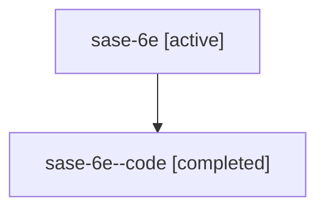

# Family: sase-6e

Owner: `bbugyi200.athena` · Hood: `sase-6e` · Members: 2

## Lineage

The diagram is an optional enhancement; the ordered table below contains the same lineage in accessible text.

| Role | Agent | State | Model / provider | Timing | Commits | Prompt | Chat |
|---|---|---|---|---|---:|---|---|
| root | sase-6e | active | gpt-5.6-sol / codex | 2026-07-16T23:40:54.892761+00:00 | 1 | [Prompt](../agents/bbugyi200.athena.sase-6e/prompt.md) | [Chat](../agents/bbugyi200.athena.sase-6e/chat.md) |
| code | sase-6e--code | completed | gpt-5.6-sol / codex | 2026-07-16T23:54:00.403045+00:00 | 0 | — | [Chat](../agents/bbugyi200.athena.sase-6e--code/chat.md) |
