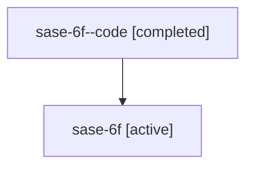

# Family: sase-6f

[Agent Hoods](../README.md) / [bbugyi200](../users/bbugyi200/README.md) / [athena](../users/bbugyi200/machines/athena/README.md) / [sase-6f](../users/bbugyi200/machines/athena/hoods/sase-6f/README.md) / sase-6f

Owner: `bbugyi200.athena` · Hood: `sase-6f` · Members: 2

## Lineage

The diagram is an optional enhancement; the ordered table below contains the same lineage in accessible text.

| Role | Agent | State | Model / provider | Timing | Commits | Prompt | Chat |
|---|---|---|---|---|---:|---|---|
| code | sase-6f--code | completed | gpt-5.6-sol / codex | 2026-07-16T20:52:19.617597+00:00 | 0 | — | [Chat](../agents/bbugyi200.athena.sase-6f--code/chat.md) |
| root | sase-6f | active | gpt-5.6-sol / codex | 2026-07-16T20:32:35.757822+00:00 | [1](../agents/bbugyi200.athena.sase-6f/README.md#commits) | [Prompt](../agents/bbugyi200.athena.sase-6f/prompt.md) | [Chat](../agents/bbugyi200.athena.sase-6f/chat.md) |

## Commits

| Role | Repo | Commit | Subject | Committed (UTC) |
|---|---|---|---|---|
| root | sase | [`73de857`](https://github.com/sase-org/sase/commit/73de8575bc63180822daf1a41cbf70855a8bb6fe) | test: cover deleted cwd through xprompt sources | 2026-07-16 21:16:09 |

## Neighbors

| Agent | Relation | State |
|---|---|---|
| [sase-6f.1](../agents/bbugyi200.athena.sase-6f.1/README.md) | descendant | active |
| [sase-6f.2](../agents/bbugyi200.athena.sase-6f.2/README.md) | descendant | active |
| [sase-6f.3](../agents/bbugyi200.athena.sase-6f.3/README.md) | descendant | active |
| [sase-6f.4](../agents/bbugyi200.athena.sase-6f.4/README.md) | descendant | active |
