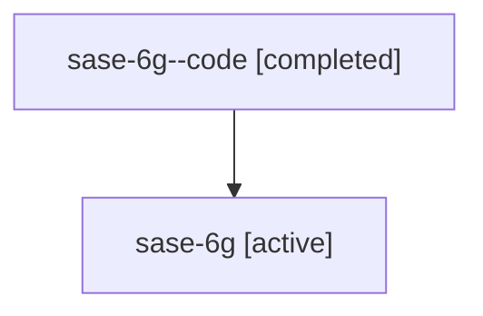

# Family: sase-6g

Owner: `bbugyi200.athena` · Hood: `sase-6g` · Members: 2

## Lineage

The diagram is an optional enhancement; the ordered table below contains the same lineage in accessible text.

| Role | Agent | State | Model / provider | Timing | Commits | Prompt | Chat |
|---|---|---|---|---|---:|---|---|
| code | sase-6g--code | completed | gpt-5.6-sol / codex | 2026-07-17T01:11:22.219585+00:00 | 1 | — | [Chat](../agents/bbugyi200.athena.sase-6g--code/chat.md) |
| root | sase-6g | active | gpt-5.6-sol / codex | 2026-07-17T00:58:57.735533+00:00 | 1 | [Prompt](../agents/bbugyi200.athena.sase-6g/prompt.md) | [Chat](../agents/bbugyi200.athena.sase-6g/chat.md) |
