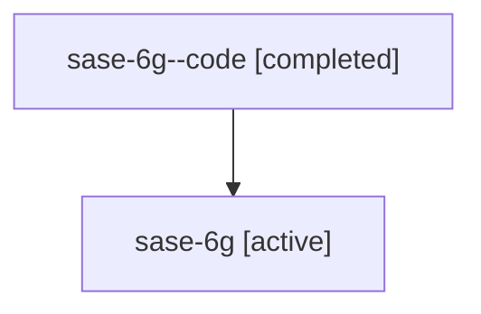

# Family: sase-6g

[Agent Hoods](../README.md) / [bbugyi200](../users/bbugyi200/README.md) / [athena](../users/bbugyi200/machines/athena/README.md) / [sase-6g](../users/bbugyi200/machines/athena/hoods/sase-6g/README.md) / sase-6g

Owner: `bbugyi200.athena` · Hood: `sase-6g` · Members: 2

## Lineage

The diagram is an optional enhancement; the ordered table below contains the same lineage in accessible text.

| Role | Agent | State | Model / provider | Timing | Commits | Prompt | Chat |
|---|---|---|---|---|---:|---|---|
| code | sase-6g--code | completed | gpt-5.6-sol / codex | 2026-07-17T01:11:22.219585+00:00 | [1](../agents/bbugyi200.athena.sase-6g--code/README.md#commits) | — | [Chat](../agents/bbugyi200.athena.sase-6g--code/chat.md) |
| root | sase-6g | active | gpt-5.6-sol / codex | 2026-07-17T00:58:57.735533+00:00 | [1](../agents/bbugyi200.athena.sase-6g/README.md#commits) | [Prompt](../agents/bbugyi200.athena.sase-6g/prompt.md) | [Chat](../agents/bbugyi200.athena.sase-6g/chat.md) |

## Commits

| Role | Commit | Subject | Committed (UTC) |
|---|---|---|---|
| code | [`0c43854`](https://github.com/sase-org/sase/commit/0c438540c6f78fb9e3e36e67037f9ab1b9846b92) | test(xprompt): cover family launch neutrality (sase-6g) | 2026-07-17 01:31:49 |
| root | [`0c43854`](https://github.com/sase-org/sase/commit/0c438540c6f78fb9e3e36e67037f9ab1b9846b92) | test(xprompt): cover family launch neutrality (sase-6g) | 2026-07-17 01:31:49 |

## Neighbors

| Agent | Relation | State |
|---|---|---|
| [sase-6g.1](../agents/bbugyi200.athena.sase-6g.1/README.md) | descendant | active |
| [sase-6g.2](../agents/bbugyi200.athena.sase-6g.2/README.md) | descendant | active |
| [sase-6g.3](../agents/bbugyi200.athena.sase-6g.3/README.md) | descendant | active |
| [sase-6g.4](../agents/bbugyi200.athena.sase-6g.4/README.md) | descendant | active |
| [sase-6g.5](../agents/bbugyi200.athena.sase-6g.5/README.md) | descendant | active |
| [sase-6g.6](../agents/bbugyi200.athena.sase-6g.6/README.md) | descendant | active |
| [sase-6g.7](../agents/bbugyi200.athena.sase-6g.7/README.md) | descendant | active |
| [sase-6g.8](../agents/bbugyi200.athena.sase-6g.8/README.md) | descendant | active |
