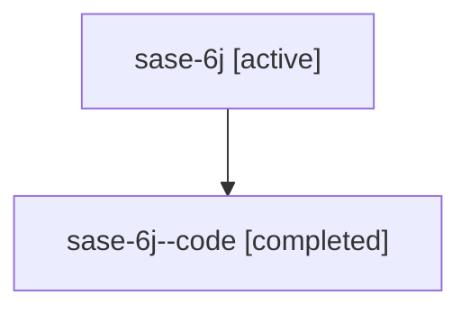

# Family: sase-6j

[Agent Hoods](../README.md) / [bbugyi200](../users/bbugyi200/README.md) / [athena](../users/bbugyi200/machines/athena/README.md) / [sase-6j](../users/bbugyi200/machines/athena/hoods/sase-6j/README.md) / sase-6j

Owner: `bbugyi200.athena` · Hood: `sase-6j` · Members: 2

## Lineage

The diagram is an optional enhancement; the ordered table below contains the same lineage in accessible text.

| Role | Agent | State | Model / provider | Timing | Commits | Prompt | Chat |
|---|---|---|---|---|---:|---|---|
| root | sase-6j | active | gpt-5.6-sol / codex | 2026-07-17T13:09:13.760152+00:00 | [1](../agents/bbugyi200.athena.sase-6j/README.md#commits) | [Prompt](../agents/bbugyi200.athena.sase-6j/prompt.md) | [Chat](../agents/bbugyi200.athena.sase-6j/chat.md) |
| code | sase-6j--code | completed | gpt-5.6-sol / codex | 2026-07-17T13:33:40.084194+00:00 | [1](../agents/bbugyi200.athena.sase-6j--code/README.md#commits) | — | [Chat](../agents/bbugyi200.athena.sase-6j--code/chat.md) |

## Commits

| Role | Commit | Subject | Committed (UTC) |
|---|---|---|---|
| code | [`be5967a`](https://github.com/sase-org/sase/commit/be5967a70a49b63bef291b03b8ea2927c76dc265) | test(tui): stabilize residual freeze soak (sase-6j.5) (sase-6j) | 2026-07-17 13:46:57 |
| root | [`be5967a`](https://github.com/sase-org/sase/commit/be5967a70a49b63bef291b03b8ea2927c76dc265) | test(tui): stabilize residual freeze soak (sase-6j.5) (sase-6j) | 2026-07-17 13:46:57 |

## Neighbors

| Agent | Relation | State |
|---|---|---|
| [sase-6j.1](../agents/bbugyi200.athena.sase-6j.1/README.md) | descendant | completed |
| [sase-6j.2](../agents/bbugyi200.athena.sase-6j.2/README.md) | descendant | completed |
| [sase-6j.3](../agents/bbugyi200.athena.sase-6j.3/README.md) | descendant | completed |
| [sase-6j.4](../agents/bbugyi200.athena.sase-6j.4/README.md) | descendant | completed |
| [sase-6j.5](../agents/bbugyi200.athena.sase-6j.5/README.md) | descendant | completed |
