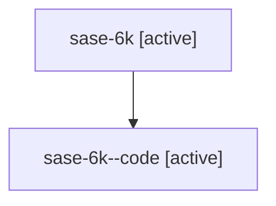

# Family: sase-6k

Owner: `bbugyi200.athena` · Hood: `sase-6k` · Members: 2

## Lineage

The diagram is an optional enhancement; the ordered table below contains the same lineage in accessible text.

| Role | Agent | State | Model / provider | Timing | Commits | Prompt | Chat |
|---|---|---|---|---|---:|---|---|
| root | sase-6k | active | gpt-5.6-sol / codex | 2026-07-17T15:24:18.911999 | 0 | [Prompt](../agents/bbugyi200.athena.sase-6k/prompt.md) | [Chat](../agents/bbugyi200.athena.sase-6k/chat.md) |
| code | sase-6k--code | active | gpt-5.6-sol / codex | 2026-07-17T19:36:50.260321+00:00 | 0 | — | — |
