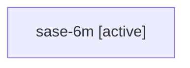

# Family: sase-6m

[Agent Hoods](../README.md) / [bbugyi200](../users/bbugyi200/README.md) / [athena](../users/bbugyi200/machines/athena/README.md) / [sase-6m](../users/bbugyi200/machines/athena/hoods/sase-6m/README.md) / sase-6m

Owner: `bbugyi200.athena` · Hood: `sase-6m` · Members: 1

## Lineage

The diagram is an optional enhancement; the ordered table below contains the same lineage in accessible text.

| Role | Agent | State | Model / provider | Timing | Commits | Prompt | Chat |
|---|---|---|---|---|---:|---|---|
| root | sase-6m | active | gpt-5.6-sol / codex | 2026-07-17T20:54:34.945506+00:00 | 0 | [Prompt](../agents/bbugyi200.athena.sase-6m/prompt.md) | [Chat](../agents/bbugyi200.athena.sase-6m/chat.md) |

## Neighbors

| Agent | Relation | State |
|---|---|---|
| [sase-6m.1](../agents/bbugyi200.athena.sase-6m.1/README.md) | descendant | active |
| [sase-6m.2](../agents/bbugyi200.athena.sase-6m.2/README.md) | descendant | active |
| [sase-6m.3](../agents/bbugyi200.athena.sase-6m.3/README.md) | descendant | active |
