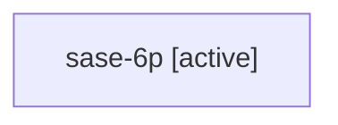

# Family: sase-6p

[Agent Hoods](../README.md) / [bbugyi200](../users/bbugyi200/README.md) / [athena](../users/bbugyi200/machines/athena/README.md) / [sase-6p](../users/bbugyi200/machines/athena/hoods/sase-6p/README.md) / sase-6p

Owner: `bbugyi200.athena` · Hood: `sase-6p` · Members: 1 · Bead: [sase-6p](https://github.com/sase-org/sase--beads/blob/main/pages/sase-6p/README.md)

## Lineage

The diagram is an optional enhancement; the ordered table below contains the same lineage in accessible text.

| Role | Agent | State | Model / provider | Timing | Commits | Prompt | Chat |
|---|---|---|---|---|---:|---|---|
| root | sase-6p | active | gpt-5.6-sol / codex | 20260717194412 | 0 | [Prompt](../agents/bbugyi200.athena.sase-6p/prompt.md) | — |

## Neighbors

| Agent | Relation | State |
|---|---|---|
| [sase-6p.1](../agents/bbugyi200.athena.sase-6p.1/README.md) | descendant | active |
| [sase-6p.2](../agents/bbugyi200.athena.sase-6p.2/README.md) | descendant | active |
| [sase-6p.3](../agents/bbugyi200.athena.sase-6p.3/README.md) | descendant | active |
| [sase-6p.4](../agents/bbugyi200.athena.sase-6p.4/README.md) | descendant | active |
| [sase-6p.5](../agents/bbugyi200.athena.sase-6p.5/README.md) | descendant | active |
| [sase-6p.6](../agents/bbugyi200.athena.sase-6p.6/README.md) | descendant | active |
| [sase-6p.7](../agents/bbugyi200.athena.sase-6p.7/README.md) | descendant | active |
| [sase-6p.8](../agents/bbugyi200.athena.sase-6p.8/README.md) | descendant | active |
