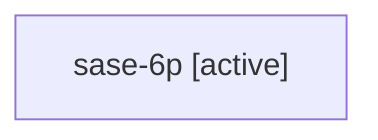

# Family: sase-6p

Owner: `bbugyi200.athena` · Hood: `sase-6p` · Members: 1

## Lineage

The diagram is an optional enhancement; the ordered table below contains the same lineage in accessible text.

| Role | Agent | State | Model / provider | Timing | Commits | Prompt | Chat |
|---|---|---|---|---|---:|---|---|
| root | sase-6p | active | gpt-5.6-sol / codex | 20260717194412 | 0 | [Prompt](../agents/bbugyi200.athena.sase-6p/prompt.md) | — |
