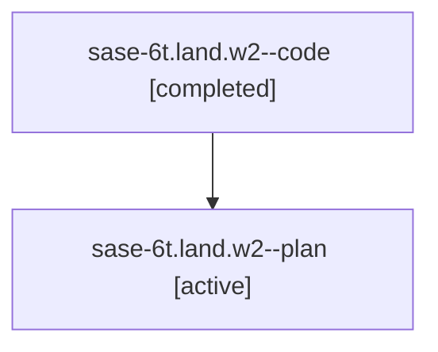

# Family: sase-6t.land.w2

[Agent Hoods](../README.md) / [bbugyi200](../users/bbugyi200/README.md) / [athena](../users/bbugyi200/machines/athena/README.md) / [sase-6t](../users/bbugyi200/machines/athena/hoods/sase-6t/README.md) / sase-6t.land.w2

Owner: `bbugyi200.athena` · Hood: `sase-6t` · Members: 2

## Lineage

The diagram is an optional enhancement; the ordered table below contains the same lineage in accessible text.

| Role | Agent | State | Model / provider | Timing | Commits | Prompt | Chat |
|---|---|---|---|---|---:|---|---|
| code | sase-6t.land.w2--code | completed | gpt-5.6-sol / codex | 2026-07-18T19:34:00.898137+00:00 | [1](../agents/bbugyi200.athena.sase-6t.land.w2--code/README.md#commits) | — | [Chat](../agents/bbugyi200.athena.sase-6t.land.w2--code/chat.md) |
| plan | sase-6t.land.w2--plan | active | gpt-5.6-sol / codex | 2026-07-18T19:23:27.374346+00:00 | 0 | [Prompt](../agents/bbugyi200.athena.sase-6t.land.w2--plan/prompt.md) | [Chat](../agents/bbugyi200.athena.sase-6t.land.w2--plan/chat.md) |

## Commits

| Role | Commit | Subject | Committed (UTC) |
|---|---|---|---|
| code | [`9de151e`](https://github.com/sase-org/sase/commit/9de151eb32c233e610776ae86eb40a579518d9bf) | feat(ace): support negative artifact filters | 2026-07-18 20:09:21 |

## Neighbors

| Agent | Relation | State |
|---|---|---|
| [sase-6t.land](../agents/bbugyi200.athena.sase-6t.land/README.md) | ancestor | active |
| [sase-6t.land.w2.w1](bbugyi200.athena.sase-6t.land.w2.w1.md) (family · 2) | descendant | active 1, completed 1 |
| [sase-6t.land.w2.w1](../agents/bbugyi200.athena.sase-6t.land.w2.w1/README.md) | descendant | completed |
| [sase-6t.land.w0](../agents/bbugyi200.athena.sase-6t.land.w0/README.md) | sase-6t.land hood | waiting |
| [sase-6t.land.w1](../agents/bbugyi200.athena.sase-6t.land.w1/README.md) | sase-6t.land hood | active |
| [sase-6t.land.w1.w0](../agents/bbugyi200.athena.sase-6t.land.w1.w0/README.md) | sase-6t.land hood | active |
| [sase-6t.1](../agents/bbugyi200.athena.sase-6t.1/README.md) | sase-6t hood | completed |
| [sase-6t.2](../agents/bbugyi200.athena.sase-6t.2/README.md) | sase-6t hood | completed |
| [sase-6t.3](../agents/bbugyi200.athena.sase-6t.3/README.md) | sase-6t hood | active |
| [sase-6t.4](../agents/bbugyi200.athena.sase-6t.4/README.md) | sase-6t hood | active |
| [sase-6t.5](../agents/bbugyi200.athena.sase-6t.5/README.md) | sase-6t hood | active |
