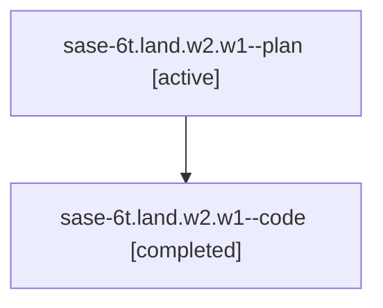

# Family: sase-6t.land.w2.w1

[Agent Hoods](../README.md) / [bbugyi200](../users/bbugyi200/README.md) / [athena](../users/bbugyi200/machines/athena/README.md) / [sase-6t](../users/bbugyi200/machines/athena/hoods/sase-6t/README.md) / sase-6t.land.w2.w1

Owner: `bbugyi200.athena` · Hood: `sase-6t` · Members: 2

## Lineage

The diagram is an optional enhancement; the ordered table below contains the same lineage in accessible text.

| Role | Agent | State | Model / provider | Timing | Commits | Prompt | Chat |
|---|---|---|---|---|---:|---|---|
| plan | sase-6t.land.w2.w1--plan | active | gpt-5.6-sol / codex | 2026-07-18T20:09:51.630208+00:00 | 0 | [Prompt](../agents/bbugyi200.athena.sase-6t.land.w2.w1--plan/prompt.md) | [Chat](../agents/bbugyi200.athena.sase-6t.land.w2.w1--plan/chat.md) |
| code | sase-6t.land.w2.w1--code | completed | gpt-5.6-sol / codex | 2026-07-18T20:26:21.243437+00:00 | [1](../agents/bbugyi200.athena.sase-6t.land.w2.w1--code/README.md#commits) | — | [Chat](../agents/bbugyi200.athena.sase-6t.land.w2.w1--code/chat.md) |

## Commits

| Role | Repo | Commit | Subject | Committed |
|---|---|---|---|---|
| code | sase | [`c8abfe2`](https://github.com/sase-org/sase/commit/c8abfe29f6653fa5615051157e470c4e5dd8ddba) | feat(ace): load linked plans in artifact details | 2026-07-18 17:00:34 EDT |

## Neighbors

| Agent | Relation | State |
|---|---|---|
| [sase-6t.land.w2](../agents/bbugyi200.athena.sase-6t.land.w2/README.md) | ancestor | completed |
| [sase-6t.land](../agents/bbugyi200.athena.sase-6t.land/README.md) | ancestor | active |
| [sase-6t.land.w0](../agents/bbugyi200.athena.sase-6t.land.w0/README.md) | sase-6t.land hood | waiting |
| [sase-6t.land.w1](../agents/bbugyi200.athena.sase-6t.land.w1/README.md) | sase-6t.land hood | active |
| [sase-6t.land.w1.w0](../agents/bbugyi200.athena.sase-6t.land.w1.w0/README.md) | sase-6t.land hood | active |
| [sase-6t.1](../agents/bbugyi200.athena.sase-6t.1/README.md) | sase-6t hood | completed |
| [sase-6t.2](../agents/bbugyi200.athena.sase-6t.2/README.md) | sase-6t hood | completed |
| [sase-6t.3](../agents/bbugyi200.athena.sase-6t.3/README.md) | sase-6t hood | active |
| [sase-6t.4](../agents/bbugyi200.athena.sase-6t.4/README.md) | sase-6t hood | active |
| [sase-6t.5](../agents/bbugyi200.athena.sase-6t.5/README.md) | sase-6t hood | active |
