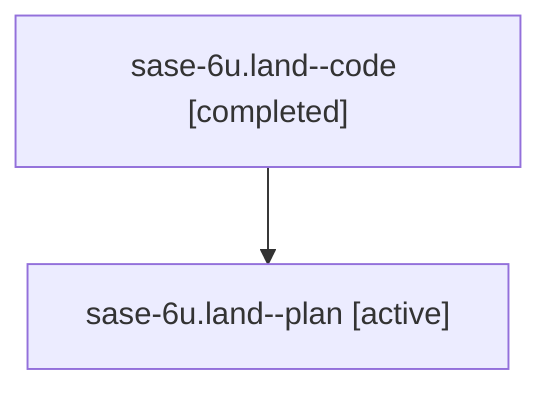

# Family: sase-6u.land

[Agent Hoods](../README.md) / [bbugyi200](../users/bbugyi200/README.md) / [athena](../users/bbugyi200/machines/athena/README.md) / [sase-6u](../users/bbugyi200/machines/athena/hoods/sase-6u/README.md) / sase-6u.land

Owner: `bbugyi200.athena` · Hood: `sase-6u` · Members: 2

## Lineage

The diagram is an optional enhancement; the ordered table below contains the same lineage in accessible text.

| Role | Agent | State | Model / provider | Timing | Commits | Prompt | Chat |
|---|---|---|---|---|---:|---|---|
| code | sase-6u.land--code | completed | gpt-5.6-sol / codex | 2026-07-18T20:59:33.220157+00:00 | [1](../agents/bbugyi200.athena.sase-6u.land--code/README.md#commits) | — | [Chat](../agents/bbugyi200.athena.sase-6u.land--code/chat.md) |
| plan | sase-6u.land--plan | active | gpt-5.6-sol / codex | 2026-07-18T20:47:38.602420+00:00 | 0 | [Prompt](../agents/bbugyi200.athena.sase-6u.land--plan/prompt.md) | [Chat](../agents/bbugyi200.athena.sase-6u.land--plan/chat.md) |

## Commits

| Role | Repo | Commit | Subject | Committed |
|---|---|---|---|---|
| code | sase | [`d28d297`](https://github.com/sase-org/sase/commit/d28d2976bb5cb312ea2ddc92d3b7d01c309dfe1d) | feat(ace): enrich folded clan summaries | 2026-07-18 17:48:46 EDT |

## Neighbors

| Agent | Relation | State |
|---|---|---|
| [sase-6u.1](../agents/bbugyi200.athena.sase-6u.1/README.md) | sase-6u hood | active |
| [sase-6u.2](../agents/bbugyi200.athena.sase-6u.2/README.md) | sase-6u hood | active |
| [sase-6u.3](../agents/bbugyi200.athena.sase-6u.3/README.md) | sase-6u hood | active |
| [sase-6u.4](../agents/bbugyi200.athena.sase-6u.4/README.md) | sase-6u hood | active |
