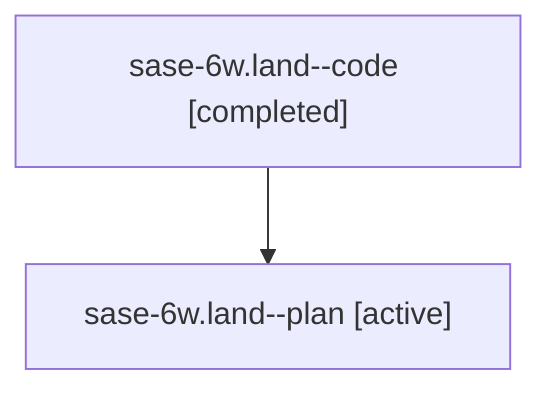

# Family: sase-6w.land

[Agent Hoods](../README.md) / [bbugyi200](../users/bbugyi200/README.md) / [athena](../users/bbugyi200/machines/athena/README.md) / [sase-6w](../users/bbugyi200/machines/athena/hoods/sase-6w/README.md) / sase-6w.land

Owner: `bbugyi200.athena` · Hood: `sase-6w` · Members: 2

## Lineage

The diagram is an optional enhancement; the ordered table below contains the same lineage in accessible text.

| Role | Agent | State | Model / provider | Timing | Commits | Prompt | Chat |
|---|---|---|---|---|---:|---|---|
| code | sase-6w.land--code | completed | gpt-5.6-sol / codex | 2026-07-19T00:58:14.574294+00:00 | [1](../agents/bbugyi200.athena.sase-6w.land--code/README.md#commits) | — | [Chat](../agents/bbugyi200.athena.sase-6w.land--code/chat.md) |
| plan | sase-6w.land--plan | active | gpt-5.6-sol / codex | 2026-07-19T00:48:15.186089+00:00 | 0 | [Prompt](../agents/bbugyi200.athena.sase-6w.land--plan/prompt.md) | [Chat](../agents/bbugyi200.athena.sase-6w.land--plan/chat.md) |

## Commits

| Role | Repo | Commit | Subject | Committed (UTC) |
|---|---|---|---|---|
| code | sase | [`8ebf710`](https://github.com/sase-org/sase/commit/8ebf710f4a1a0c13dd23585212c77506eb7881ce) | test: align statistics fixtures and agent snapshots (sase-6w) | 2026-07-19 01:38:14 |

## Neighbors

| Agent | Relation | State |
|---|---|---|
| [sase-6w.land.w0](../agents/bbugyi200.athena.sase-6w.land.w0/README.md) | descendant | waiting |
| [sase-6w.land.w1](../agents/bbugyi200.athena.sase-6w.land.w1/README.md) | descendant | waiting |
| [sase-6w.land.w2](../agents/bbugyi200.athena.sase-6w.land.w2/README.md) | descendant | waiting |
| [sase-6w.land.w3](../agents/bbugyi200.athena.sase-6w.land.w3/README.md) | descendant | active |
| [sase-6w.land.w4](../agents/bbugyi200.athena.sase-6w.land.w4/README.md) | descendant | active |
| [sase-6w.1](../agents/bbugyi200.athena.sase-6w.1/README.md) | sase-6w hood | active |
| [sase-6w.2](../agents/bbugyi200.athena.sase-6w.2/README.md) | sase-6w hood | active |
| [sase-6w.3](../agents/bbugyi200.athena.sase-6w.3/README.md) | sase-6w hood | active |
| [sase-6w.4](../agents/bbugyi200.athena.sase-6w.4/README.md) | sase-6w hood | active |
| [sase-6w.w0](../agents/bbugyi200.athena.sase-6w.w0/README.md) | sase-6w hood | waiting |
