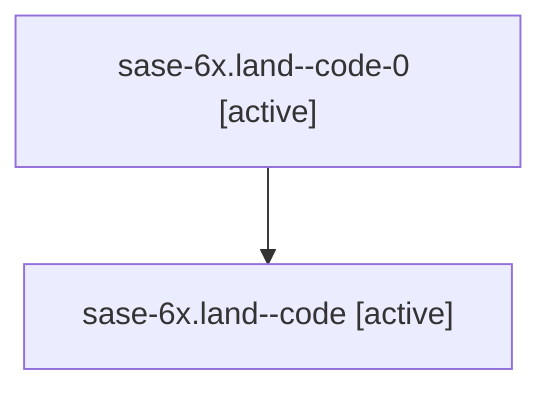

# Family: sase-6x.land

[Agent Hoods](../README.md) / [bbugyi200](../users/bbugyi200/README.md) / [athena](../users/bbugyi200/machines/athena/README.md) / [sase-6x](../users/bbugyi200/machines/athena/hoods/sase-6x/README.md) / sase-6x.land

Owner: `bbugyi200.athena` · Hood: `sase-6x` · Members: 2 · Bead: [sase-6x](https://github.com/sase-org/sase--beads/blob/main/pages/sase-6x/README.md)

## Lineage

The diagram is an optional enhancement; the ordered table below contains the same lineage in accessible text.

| Role | Agent | State | Model / provider | Timing | Commits | Prompt | Chat |
|---|---|---|---|---|---:|---|---|
| code-0 | sase-6x.land--code-0 | active | gpt-5.6-sol / codex | 2026-07-19T00:18:57.734775+00:00 | 0 | — | — |
| code | sase-6x.land--code | active | gpt-5.6-sol / codex | 2026-07-18T23:47:36.490278+00:00 | 0 | — | [Chat](../agents/bbugyi200.athena.sase-6x.land--code/chat.md) |

## Neighbors

| Agent | Relation | State |
|---|---|---|
| [sase-6x.1](../agents/bbugyi200.athena.sase-6x.1/README.md) | sase-6x hood | active |
| [sase-6x.2](../agents/bbugyi200.athena.sase-6x.2/README.md) | sase-6x hood | active |
| [sase-6x.3](../agents/bbugyi200.athena.sase-6x.3/README.md) | sase-6x hood | active |
| [sase-6x.4](../agents/bbugyi200.athena.sase-6x.4/README.md) | sase-6x hood | active |
