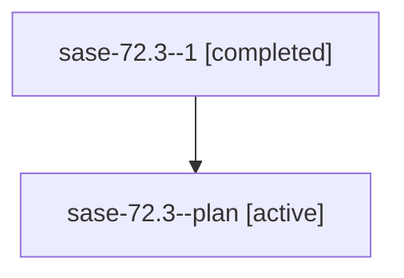

# Family: sase-72.3

[Agent Hoods](../README.md) / [bbugyi200](../users/bbugyi200/README.md) / [athena](../users/bbugyi200/machines/athena/README.md) / [sase-72](../users/bbugyi200/machines/athena/hoods/sase-72/README.md) / sase-72.3

Owner: `bbugyi200.athena` · Hood: `sase-72` · Members: 2

## Lineage

The diagram is an optional enhancement; the ordered table below contains the same lineage in accessible text.

| Role | Agent | State | Model / provider | Timing | Commits | Prompt | Chat |
|---|---|---|---|---|---:|---|---|
| 1 | sase-72.3--1 | completed | gpt-5.6-sol / codex | 2026-07-19T04:54:44.633984+00:00 | [1](../agents/bbugyi200.athena.sase-72.3--1/README.md#commits) | — | [Chat](../agents/bbugyi200.athena.sase-72.3--1/chat.md) |
| plan | sase-72.3--plan | active | gpt-5.6-sol / codex | 2026-07-19T04:35:15.624216+00:00 | 0 | [Prompt](../agents/bbugyi200.athena.sase-72.3--plan/prompt.md) | [Chat](../agents/bbugyi200.athena.sase-72.3--plan/chat.md) |

## Commits

| Role | Commit | Subject | Committed (UTC) |
|---|---|---|---|
| 1 | [`fae9dbb`](https://github.com/sase-org/sase/commit/fae9dbb340d7ca69ae61ffe610b29f2ed9e8dc21) | test(chop): isolate result-file contract tests (sase-72.3) | 2026-07-19 05:44:57 |

## Neighbors

| Agent | Relation | State |
|---|---|---|
| [sase-72.1](../agents/bbugyi200.athena.sase-72.1/README.md) | sase-72 hood | active |
| [sase-72.2](../agents/bbugyi200.athena.sase-72.2/README.md) | sase-72 hood | active |
| [sase-72.land](../agents/bbugyi200.athena.sase-72.land/README.md) | sase-72 hood | active |
