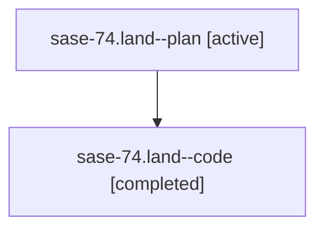

# Family: sase-74.land

[Agent Hoods](../README.md) / [bbugyi200](../users/bbugyi200/README.md) / [athena](../users/bbugyi200/machines/athena/README.md) / [sase-74](../users/bbugyi200/machines/athena/hoods/sase-74/README.md) / sase-74.land

Owner: `bbugyi200.athena` · Hood: `sase-74` · Members: 2 · Bead: [sase-74](https://github.com/sase-org/sase--beads/blob/main/pages/sase-74/README.md)

## Lineage

The diagram is an optional enhancement; the ordered table below contains the same lineage in accessible text.

| Role | Agent | State | Model / provider | Timing | Commits | Prompt | Chat |
|---|---|---|---|---|---:|---|---|
| plan | sase-74.land--plan | active | gpt-5.6-sol / codex | 2026-07-19T13:54:50.680321+00:00 | 0 | [Prompt](../agents/bbugyi200.athena.sase-74.land--plan/prompt.md) | [Chat](../agents/bbugyi200.athena.sase-74.land--plan/chat.md) |
| code | sase-74.land--code | completed | gpt-5.6-sol / codex | 2026-07-19T14:06:30.379597+00:00 | [1](../agents/bbugyi200.athena.sase-74.land--code/README.md#commits) | — | [Chat](../agents/bbugyi200.athena.sase-74.land--code/chat.md) |

## Commits

| Role | Repo | Commit | Subject | Committed |
|---|---|---|---|---|
| code | sase | [`a9065c2`](https://github.com/sase-org/sase/commit/a9065c25eaaf49de3ad5f5b45bc46237e9db11d7) | docs: document clan-scoped agent cleanup (sase-74) | 2026-07-19 14:17:05 UTC |

## Neighbors

| Agent | Relation | State |
|---|---|---|
| [sase-74.1](../agents/bbugyi200.athena.sase-74.1/README.md) | sase-74 hood | active |
| [sase-74.2](../agents/bbugyi200.athena.sase-74.2/README.md) | sase-74 hood | active |
| [sase-74.3](../agents/bbugyi200.athena.sase-74.3/README.md) | sase-74 hood | active |
