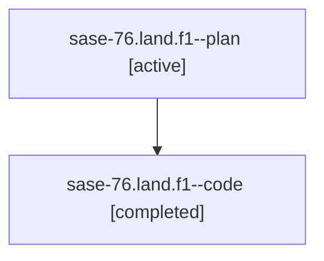

# Family: sase-76.land.f1

[Agent Hoods](../README.md) / [bbugyi200](../users/bbugyi200/README.md) / [athena](../users/bbugyi200/machines/athena/README.md) / [sase-76](../users/bbugyi200/machines/athena/hoods/sase-76/README.md) / sase-76.land.f1

Owner: `bbugyi200.athena` · Hood: `sase-76` · Members: 2

## Lineage

The diagram is an optional enhancement; the ordered table below contains the same lineage in accessible text.

| Role | Agent | State | Model / provider | Timing | Commits | Prompt | Chat |
|---|---|---|---|---|---:|---|---|
| plan | sase-76.land.f1--plan | active | gpt-5.6-sol / codex | 2026-07-19T16:56:09.613602+00:00 | 0 | [Prompt](../agents/bbugyi200.athena.sase-76.land.f1--plan/prompt.md) | [Chat](../agents/bbugyi200.athena.sase-76.land.f1--plan/chat.md) |
| code | sase-76.land.f1--code | completed | gpt-5.6-sol / codex | 2026-07-19T17:02:41.836533+00:00 | [1](../agents/bbugyi200.athena.sase-76.land.f1--code/README.md#commits) | — | [Chat](../agents/bbugyi200.athena.sase-76.land.f1--code/chat.md) |

## Commits

| Role | Repo | Commit | Subject | Committed |
|---|---|---|---|---|
| code | sase | [`24a5fb6`](https://github.com/sase-org/sase/commit/24a5fb69cba6a31215ea88ef1a59c3af6d97357c) | fix(ace): restore contextual query shortcuts | 2026-07-19 13:42:12 EDT |

## Neighbors

| Agent | Relation | State |
|---|---|---|
| [sase-76.land](../agents/bbugyi200.athena.sase-76.land/README.md) | ancestor | active |
| [sase-76.1](../agents/bbugyi200.athena.sase-76.1/README.md) | sase-76 hood | active |
| [sase-76.2](../agents/bbugyi200.athena.sase-76.2/README.md) | sase-76 hood | active |
| [sase-76.3](../agents/bbugyi200.athena.sase-76.3/README.md) | sase-76 hood | active |
