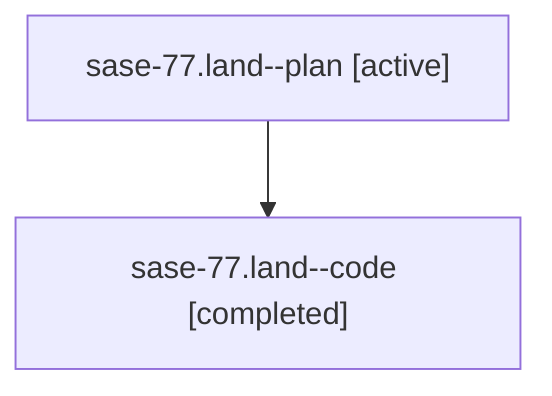

# Family: sase-77.land

[Agent Hoods](../README.md) / [bbugyi200](../users/bbugyi200/README.md) / [athena](../users/bbugyi200/machines/athena/README.md) / [sase-77](../users/bbugyi200/machines/athena/hoods/sase-77/README.md) / sase-77.land

Owner: `bbugyi200.athena` · Hood: `sase-77` · Members: 2

## Lineage

The diagram is an optional enhancement; the ordered table below contains the same lineage in accessible text.

| Role | Agent | State | Model / provider | Timing | Commits | Prompt | Chat |
|---|---|---|---|---|---:|---|---|
| plan | sase-77.land--plan | active | gpt-5.6-sol / codex | 2026-07-19T14:50:08.920557+00:00 | 0 | [Prompt](../agents/bbugyi200.athena.sase-77.land--plan/prompt.md) | [Chat](../agents/bbugyi200.athena.sase-77.land--plan/chat.md) |
| code | sase-77.land--code | completed | gpt-5.6-sol / codex | 2026-07-19T14:56:59.180418+00:00 | [1](../agents/bbugyi200.athena.sase-77.land--code/README.md#commits) | — | [Chat](../agents/bbugyi200.athena.sase-77.land--code/chat.md) |

## Commits

| Role | Repo | Commit | Subject | Committed |
|---|---|---|---|---|
| — | sase | [`50f0718`](https://github.com/sase-org/sase/commit/50f0718b77722959fd7eb34d6337a853d8f74ae2) | fix(sdd): recover remaining Git index lock contention (sase-77) | 2026-07-19 13:13:50 EDT |
| code | sase | [`bd7f969`](https://github.com/sase-org/sase/commit/bd7f969711101f08a5867fa6821933f29f4f5f2b) | fix(sdd): expose the shared lock retry schedule (sase-77) | 2026-07-19 13:16:40 EDT |

## Neighbors

| Agent | Relation | State |
|---|---|---|
| [sase-77.1](../agents/bbugyi200.athena.sase-77.1/README.md) | sase-77 hood | active |
| [sase-77.2](../agents/bbugyi200.athena.sase-77.2/README.md) | sase-77 hood | active |
| [sase-77.3](../agents/bbugyi200.athena.sase-77.3/README.md) | sase-77 hood | active |
| [sase-77.4](../agents/bbugyi200.athena.sase-77.4/README.md) | sase-77 hood | active |
