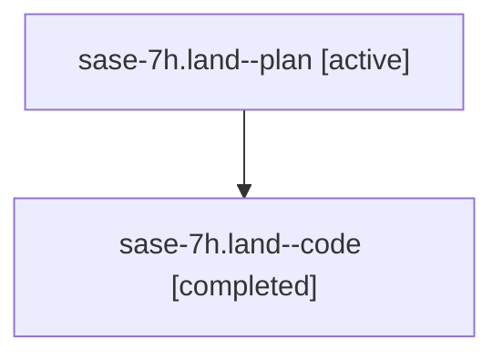

# Family: sase-7h.land

Owner: `bbugyi200.athena` · Hood: `sase-7h` · Members: 2

## Lineage

The diagram is an optional enhancement; the ordered table below contains the same lineage in accessible text.

| Role | Agent | State | Model / provider | Timing | Commits | Prompt | Chat |
|---|---|---|---|---|---:|---|---|
| plan | sase-7h.land--plan | active | gpt-5.6-sol / codex | 2026-07-19T17:24:01.897380+00:00 | 0 | [Prompt](../agents/bbugyi200.athena.sase-7h.land--plan/prompt.md) | [Chat](../agents/bbugyi200.athena.sase-7h.land--plan/chat.md) |
| code | sase-7h.land--code | completed | gpt-5.6-sol / codex | 2026-07-19T17:34:52.565203+00:00 | 1 | — | [Chat](../agents/bbugyi200.athena.sase-7h.land--code/chat.md) |
