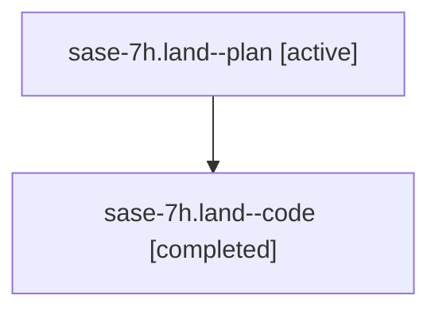

# Family: sase-7h.land

[Agent Hoods](../README.md) / [bbugyi200](../users/bbugyi200/README.md) / [athena](../users/bbugyi200/machines/athena/README.md) / [sase-7h](../users/bbugyi200/machines/athena/hoods/sase-7h/README.md) / sase-7h.land

Owner: `bbugyi200.athena` · Hood: `sase-7h` · Members: 2 · Bead: [sase-7h](https://github.com/sase-org/sase--beads/blob/main/pages/sase-7h/README.md)

## Lineage

The diagram is an optional enhancement; the ordered table below contains the same lineage in accessible text.

| Role | Agent | State | Model / provider | Timing | Commits | Prompt | Chat |
|---|---|---|---|---|---:|---|---|
| plan | sase-7h.land--plan | active | gpt-5.6-sol / codex | 2026-07-19T17:24:01.897380+00:00 | 0 | [Prompt](../agents/bbugyi200.athena.sase-7h.land--plan/prompt.md) | [Chat](../agents/bbugyi200.athena.sase-7h.land--plan/chat.md) |
| code | sase-7h.land--code | completed | gpt-5.6-sol / codex | 2026-07-19T17:34:52.565203+00:00 | [1](../agents/bbugyi200.athena.sase-7h.land--code/README.md#commits) | — | [Chat](../agents/bbugyi200.athena.sase-7h.land--code/chat.md) |

## Commits

| Role | Repo | Commit | Subject | Committed |
|---|---|---|---|---|
| code | sase | [`9292056`](https://github.com/sase-org/sase/commit/9292056356591c4c58558300dafe03dfb0082fa7) | fix(ace): deduplicate selected wait clauses | 2026-07-19 14:58:39 EDT |

## Neighbors

| Agent | Relation | State |
|---|---|---|
| [sase-7h.1](../agents/bbugyi200.athena.sase-7h.1/README.md) | sase-7h hood | active |
| [sase-7h.2](../agents/bbugyi200.athena.sase-7h.2/README.md) | sase-7h hood | active |
