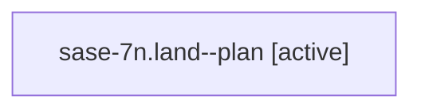

# Family: sase-7n.land

[Agent Hoods](../README.md) / [bbugyi200](../users/bbugyi200/README.md) / [athena](../users/bbugyi200/machines/athena/README.md) / [sase-7n](../users/bbugyi200/machines/athena/hoods/sase-7n/README.md) / sase-7n.land

Owner: `bbugyi200.athena` · Hood: `sase-7n` · Members: 1

## Lineage

The diagram is an optional enhancement; the ordered table below contains the same lineage in accessible text.

| Role | Agent | State | Model / provider | Timing | Commits | Prompt | Chat |
|---|---|---|---|---|---:|---|---|
| plan | sase-7n.land--plan | active | gpt-5.6-sol / codex | 2026-07-19T19:54:50.219570+00:00 | 0 | [Prompt](../agents/bbugyi200.athena.sase-7n.land--plan/prompt.md) | [Chat](../agents/bbugyi200.athena.sase-7n.land--plan/chat.md) |

## Neighbors

| Agent | Relation | State |
|---|---|---|
| [sase-7n.1](../agents/bbugyi200.athena.sase-7n.1/README.md) | sase-7n hood | active |
| [sase-7n.2](../agents/bbugyi200.athena.sase-7n.2/README.md) | sase-7n hood | active |
| [sase-7n.3](../agents/bbugyi200.athena.sase-7n.3/README.md) | sase-7n hood | active |
