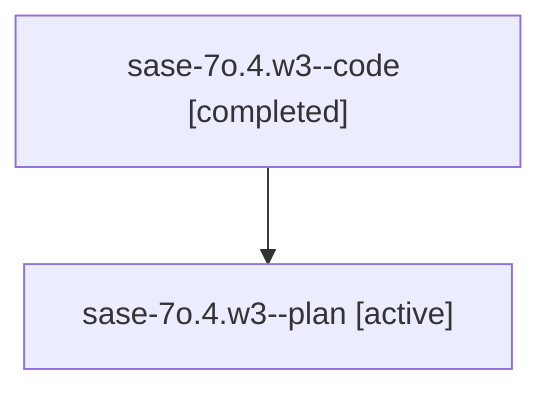

# Family: sase-7o.4.w3

[Agent Hoods](../README.md) / [bbugyi200](../users/bbugyi200/README.md) / [athena](../users/bbugyi200/machines/athena/README.md) / [sase-7o](../users/bbugyi200/machines/athena/hoods/sase-7o/README.md) / sase-7o.4.w3

Owner: `bbugyi200.athena` · Hood: `sase-7o` · Members: 2

## Lineage

The diagram is an optional enhancement; the ordered table below contains the same lineage in accessible text.

| Role | Agent | State | Model / provider | Timing | Commits | Prompt | Chat |
|---|---|---|---|---|---:|---|---|
| code | sase-7o.4.w3--code | completed | gpt-5.6-sol / codex | 2026-07-19T22:32:10.034174+00:00 | [1](../agents/bbugyi200.athena.sase-7o.4.w3--code/README.md#commits) | — | [Chat](../agents/bbugyi200.athena.sase-7o.4.w3--code/chat.md) |
| plan | sase-7o.4.w3--plan | active | gpt-5.6-sol / codex | 2026-07-19T21:52:27.060013+00:00 | 0 | [Prompt](../agents/bbugyi200.athena.sase-7o.4.w3--plan/prompt.md) | [Chat](../agents/bbugyi200.athena.sase-7o.4.w3--plan/chat.md) |

## Commits

| Role | Repo | Commit | Subject | Committed (UTC) |
|---|---|---|---|---|
| code | sase | [`6de6ee3`](https://github.com/sase-org/sase/commit/6de6ee32b03b4c5151df146f97302ce3a03f712c) | feat(ace): reserve the default agent tribe panel | 2026-07-19 23:03:17 |

## Neighbors

| Agent | Relation | State |
|---|---|---|
| [sase-7o.4](../agents/bbugyi200.athena.sase-7o.4/README.md) | ancestor | active |
| [sase-7o.4.w2](../agents/bbugyi200.athena.sase-7o.4.w2/README.md) | sase-7o.4 hood | active |
| [sase-7o.1](../agents/bbugyi200.athena.sase-7o.1/README.md) | sase-7o hood | active |
| [sase-7o.2](../agents/bbugyi200.athena.sase-7o.2/README.md) | sase-7o hood | active |
| [sase-7o.3](../agents/bbugyi200.athena.sase-7o.3/README.md) | sase-7o hood | active |
| [sase-7o.5](../agents/bbugyi200.athena.sase-7o.5/README.md) | sase-7o hood | active |
| [sase-7o.land](../agents/bbugyi200.athena.sase-7o.land/README.md) | sase-7o hood | active |
| [sase-7o.w0](../agents/bbugyi200.athena.sase-7o.w0/README.md) | sase-7o hood | waiting |
| [sase-7o.w1](../agents/bbugyi200.athena.sase-7o.w1/README.md) | sase-7o hood | active |
| [sase-7o.w2](../agents/bbugyi200.athena.sase-7o.w2/README.md) | sase-7o hood | active |
| [sase-7o.w3](../agents/bbugyi200.athena.sase-7o.w3/README.md) | sase-7o hood | active |
