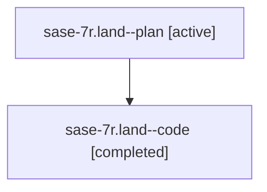

# Family: sase-7r.land

[Agent Hoods](../README.md) / [bbugyi200](../users/bbugyi200/README.md) / [athena](../users/bbugyi200/machines/athena/README.md) / [sase-7r](../users/bbugyi200/machines/athena/hoods/sase-7r/README.md) / sase-7r.land

Owner: `bbugyi200.athena` · Hood: `sase-7r` · Members: 2 · Bead: [sase-7r](https://github.com/sase-org/sase--beads/blob/main/pages/sase-7r/README.md)

## Lineage

The diagram is an optional enhancement; the ordered table below contains the same lineage in accessible text.

| Role | Agent | State | Model / provider | Timing | Commits | Prompt | Chat |
|---|---|---|---|---|---:|---|---|
| plan | sase-7r.land--plan | active | claude-fable-5 / claude | 2026-07-20T01:12:32.372133+00:00 | 0 | [Prompt](../agents/bbugyi200.athena.sase-7r.land--plan/prompt.md) | [Chat](../agents/bbugyi200.athena.sase-7r.land--plan/chat.md) |
| code | sase-7r.land--code | completed | gpt-5.6-sol / codex | 2026-07-20T01:24:34.782251+00:00 | [1](../agents/bbugyi200.athena.sase-7r.land--code/README.md#commits) | — | [Chat](../agents/bbugyi200.athena.sase-7r.land--code/chat.md) |

## Commits

| Role | Repo | Commit | Subject | Committed |
|---|---|---|---|---|
| code | sase | [`974c014`](https://github.com/sase-org/sase/commit/974c0149526d16b233fb72679f07041a3a8a609e) | fix(xprompt): preserve clan summaries during directive edits (sase-7r) | 2026-07-19 21:41:33 EDT |

## Neighbors

| Agent | Relation | State |
|---|---|---|
| [sase-7r.1](../agents/bbugyi200.athena.sase-7r.1/README.md) | sase-7r hood | active |
| [sase-7r.2](../agents/bbugyi200.athena.sase-7r.2/README.md) | sase-7r hood | active |
| [sase-7r.3](../agents/bbugyi200.athena.sase-7r.3/README.md) | sase-7r hood | active |
| [sase-7r.4](../agents/bbugyi200.athena.sase-7r.4/README.md) | sase-7r hood | active |
| [sase-7r.5](../agents/bbugyi200.athena.sase-7r.5/README.md) | sase-7r hood | active |
| [sase-7r.6](../agents/bbugyi200.athena.sase-7r.6/README.md) | sase-7r hood | active |
| [sase-7r.7](../agents/bbugyi200.athena.sase-7r.7/README.md) | sase-7r hood | active |
