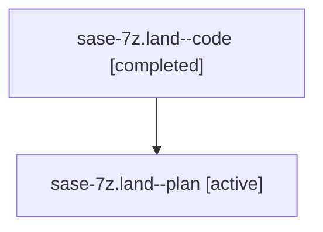

# Family: sase-7z.land

Owner: `bbugyi200.athena` · Hood: `sase-7z` · Members: 2

## Lineage

The diagram is an optional enhancement; the ordered table below contains the same lineage in accessible text.

| Role | Agent | State | Model / provider | Timing | Commits | Prompt | Chat |
|---|---|---|---|---|---:|---|---|
| code | sase-7z.land--code | completed | gpt-5.6-sol / codex | 2026-07-20T14:27:52.559847+00:00 | 1 | — | [Chat](../agents/bbugyi200.athena.sase-7z.land--code/chat.md) |
| plan | sase-7z.land--plan | active | claude-fable-5 / claude | 2026-07-20T14:20:38.059174+00:00 | 0 | [Prompt](../agents/bbugyi200.athena.sase-7z.land--plan/prompt.md) | [Chat](../agents/bbugyi200.athena.sase-7z.land--plan/chat.md) |
