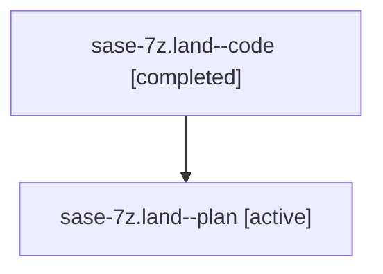

# Family: sase-7z.land

[Agent Hoods](../README.md) / [bbugyi200](../users/bbugyi200/README.md) / [athena](../users/bbugyi200/machines/athena/README.md) / [sase-7z](../users/bbugyi200/machines/athena/hoods/sase-7z/README.md) / sase-7z.land

Owner: `bbugyi200.athena` · Hood: `sase-7z` · Members: 2

## Lineage

The diagram is an optional enhancement; the ordered table below contains the same lineage in accessible text.

| Role | Agent | State | Model / provider | Timing | Commits | Prompt | Chat |
|---|---|---|---|---|---:|---|---|
| code | sase-7z.land--code | completed | gpt-5.6-sol / codex | 2026-07-20T14:27:52.559847+00:00 | 0 | — | [Chat](../agents/bbugyi200.athena.sase-7z.land--code/chat.md) |
| plan | sase-7z.land--plan | active | claude-fable-5 / claude | 2026-07-20T14:20:38.059174+00:00 | 0 | [Prompt](../agents/bbugyi200.athena.sase-7z.land--plan/prompt.md) | [Chat](../agents/bbugyi200.athena.sase-7z.land--plan/chat.md) |

## Neighbors

| Agent | Relation | State |
|---|---|---|
| [sase-7z.land.f0](../agents/bbugyi200.athena.sase-7z.land.f0/README.md) | descendant | active |
| [sase-7z.1](../agents/bbugyi200.athena.sase-7z.1/README.md) | sase-7z hood | active |
| [sase-7z.2](../agents/bbugyi200.athena.sase-7z.2/README.md) | sase-7z hood | active |
| [sase-7z.3](../agents/bbugyi200.athena.sase-7z.3/README.md) | sase-7z hood | active |
| [sase-7z.4](../agents/bbugyi200.athena.sase-7z.4/README.md) | sase-7z hood | active |
| [sase-7z.5](../agents/bbugyi200.athena.sase-7z.5/README.md) | sase-7z hood | active |
| [sase-7z.6](../agents/bbugyi200.athena.sase-7z.6/README.md) | sase-7z hood | active |
| [sase-7z.7](../agents/bbugyi200.athena.sase-7z.7/README.md) | sase-7z hood | active |
| [sase-7z.8](../agents/bbugyi200.athena.sase-7z.8/README.md) | sase-7z hood | active |
| [sase-7z.f0](../agents/bbugyi200.athena.sase-7z.f0/README.md) | sase-7z hood | waiting |
| [sase-7z.f1](../agents/bbugyi200.athena.sase-7z.f1/README.md) | sase-7z hood | waiting |
| [sase-7z.f2](../agents/bbugyi200.athena.sase-7z.f2/README.md) | sase-7z hood | active |
| [sase-7z.f4](../agents/bbugyi200.athena.sase-7z.f4/README.md) | sase-7z hood | active |
