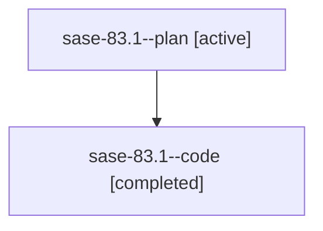

# Family: sase-83.1

[Agent Hoods](../README.md) / [bbugyi200](../users/bbugyi200/README.md) / [athena](../users/bbugyi200/machines/athena/README.md) / [sase-83](../users/bbugyi200/machines/athena/hoods/sase-83/README.md) / sase-83.1

Owner: `bbugyi200.athena` · Hood: `sase-83` · Members: 2 · Bead: [sase-83.1](https://github.com/sase-org/sase--beads/blob/main/pages/sase-83/sase-83.1.md)

## Lineage

The diagram is an optional enhancement; the ordered table below contains the same lineage in accessible text.

| Role | Agent | State | Model / provider | Timing | Commits | Prompt | Chat |
|---|---|---|---|---|---:|---|---|
| plan | sase-83.1--plan | active | gpt-5.6-sol / codex | 2026-07-20T14:23:19.597882+00:00 | 0 | [Prompt](../agents/bbugyi200.athena.sase-83.1--plan/prompt.md) | [Chat](../agents/bbugyi200.athena.sase-83.1--plan/chat.md) |
| code | sase-83.1--code | completed | gpt-5.6-sol / codex | 2026-07-20T14:26:51.311078+00:00 | [1](../agents/bbugyi200.athena.sase-83.1--code/README.md#commits) | — | [Chat](../agents/bbugyi200.athena.sase-83.1--code/chat.md) |

## Commits

| Role | Repo | Commit | Subject | Committed |
|---|---|---|---|---|
| code | sase | [`c0d68a4`](https://github.com/sase-org/sase/commit/c0d68a4f21a7fdac281094d8823eef4b1e08294e) | feat(updates): track provider CLI update candidates (sase-83.1) | 2026-07-20 14:57:32 UTC |

## Neighbors

| Agent | Relation | State |
|---|---|---|
| [sase-83.2](bbugyi200.athena.sase-83.2.md) (family · 2) | sase-83 hood | active 1, completed 1 |
| [sase-83.3](../agents/bbugyi200.athena.sase-83.3/README.md) | sase-83 hood | active |
| [sase-83.land](bbugyi200.athena.sase-83.land.md) (family · 2) | sase-83 hood | active 1, completed 1 |
