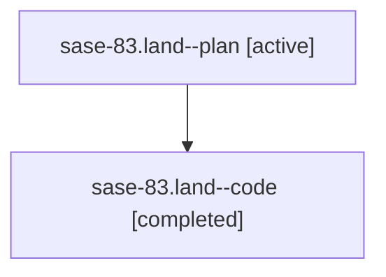

# Family: sase-83.land

[Agent Hoods](../README.md) / [bbugyi200](../users/bbugyi200/README.md) / [athena](../users/bbugyi200/machines/athena/README.md) / [sase-83](../users/bbugyi200/machines/athena/hoods/sase-83/README.md) / sase-83.land

Owner: `bbugyi200.athena` · Hood: `sase-83` · Members: 2

## Lineage

The diagram is an optional enhancement; the ordered table below contains the same lineage in accessible text.

| Role | Agent | State | Model / provider | Timing | Commits | Prompt | Chat |
|---|---|---|---|---|---:|---|---|
| plan | sase-83.land--plan | active | gpt-5.6-sol / codex | 2026-07-20T16:40:48.529206+00:00 | 0 | [Prompt](../agents/bbugyi200.athena.sase-83.land--plan/prompt.md) | [Chat](../agents/bbugyi200.athena.sase-83.land--plan/chat.md) |
| code | sase-83.land--code | completed | gpt-5.6-sol / codex | 2026-07-20T17:26:00.833954+00:00 | [1](../agents/bbugyi200.athena.sase-83.land--code/README.md#commits) | — | [Chat](../agents/bbugyi200.athena.sase-83.land--code/chat.md) |

## Commits

| Role | Repo | Commit | Subject | Committed |
|---|---|---|---|---|
| code | sase | [`1227d91`](https://github.com/sase-org/sase/commit/1227d918817639a90a291c953cc6da21e3ea3f72) | test: restore review-runner environment isolation (sase-83) | 2026-07-20 13:40:28 EDT |

## Neighbors

| Agent | Relation | State |
|---|---|---|
| [sase-83.1](bbugyi200.athena.sase-83.1.md) (family · 2) | sase-83 hood | active 1, completed 1 |
| [sase-83.2](bbugyi200.athena.sase-83.2.md) (family · 2) | sase-83 hood | active 1, completed 1 |
| [sase-83.3](../agents/bbugyi200.athena.sase-83.3/README.md) | sase-83 hood | active |
