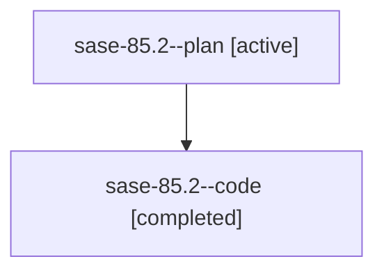

# Family: sase-85.2

[Agent Hoods](../README.md) / [bbugyi200](../users/bbugyi200/README.md) / [athena](../users/bbugyi200/machines/athena/README.md) / [sase-85](../users/bbugyi200/machines/athena/hoods/sase-85/README.md) / sase-85.2

Owner: `bbugyi200.athena` · Hood: `sase-85` · Members: 2 · Bead: [sase-85.2](https://github.com/sase-org/sase--beads/blob/main/pages/sase-85/sase-85.2.md)

## Lineage

The diagram is an optional enhancement; the ordered table below contains the same lineage in accessible text.

| Role | Agent | State | Model / provider | Timing | Commits | Prompt | Chat |
|---|---|---|---|---|---:|---|---|
| plan | sase-85.2--plan | active | gpt-5.6-sol / codex | 2026-07-20T15:29:43.393369+00:00 | 0 | [Prompt](../agents/bbugyi200.athena.sase-85.2--plan/prompt.md) | [Chat](../agents/bbugyi200.athena.sase-85.2--plan/chat.md) |
| code | sase-85.2--code | completed | gpt-5.6-sol / codex | 2026-07-20T15:33:17.087343+00:00 | [1](../agents/bbugyi200.athena.sase-85.2--code/README.md#commits) | — | [Chat](../agents/bbugyi200.athena.sase-85.2--code/chat.md) |

## Commits

| Role | Repo | Commit | Subject | Committed |
|---|---|---|---|---|
| code | sase | [`01c5b80`](https://github.com/sase-org/sase/commit/01c5b8022662bba689d147a70fd7d2cd6c8d6c48) | feat: enrich epic clan summaries (sase-85.2) | 2026-07-20 16:01:27 UTC |

## Neighbors

| Agent | Relation | State |
|---|---|---|
| [sase-85.1](bbugyi200.athena.sase-85.1.md) (family · 2) | sase-85 hood | active 1, completed 1 |
| [sase-85.3](../agents/bbugyi200.athena.sase-85.3/README.md) | sase-85 hood | active |
| [sase-85.land](bbugyi200.athena.sase-85.land.md) (family · 2) | sase-85 hood | active 1, completed 1 |
