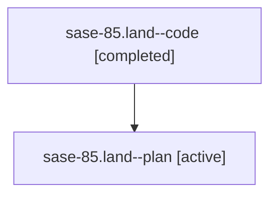

# Family: sase-85.land

[Agent Hoods](../README.md) / [bbugyi200](../users/bbugyi200/README.md) / [athena](../users/bbugyi200/machines/athena/README.md) / [sase-85](../users/bbugyi200/machines/athena/hoods/sase-85/README.md) / sase-85.land

Owner: `bbugyi200.athena` · Hood: `sase-85` · Members: 2

## Lineage

The diagram is an optional enhancement; the ordered table below contains the same lineage in accessible text.

| Role | Agent | State | Model / provider | Timing | Commits | Prompt | Chat |
|---|---|---|---|---|---:|---|---|
| code | sase-85.land--code | completed | gpt-5.6-sol / codex | 2026-07-20T16:23:09.254514+00:00 | [1](../agents/bbugyi200.athena.sase-85.land--code/README.md#commits) | — | [Chat](../agents/bbugyi200.athena.sase-85.land--code/chat.md) |
| plan | sase-85.land--plan | active | gpt-5.6-sol / codex | 2026-07-20T16:13:13.497871+00:00 | 0 | [Prompt](../agents/bbugyi200.athena.sase-85.land--plan/prompt.md) | [Chat](../agents/bbugyi200.athena.sase-85.land--plan/chat.md) |

## Commits

| Role | Repo | Commit | Subject | Committed |
|---|---|---|---|---|
| code | sase | [`f87a09c`](https://github.com/sase-org/sase/commit/f87a09c423fef75701b816dbfaa67370d7a8832b) | test: cover stale epic summary clone recovery (sase-85) | 2026-07-20 12:42:58 EDT |

## Neighbors

| Agent | Relation | State |
|---|---|---|
| [sase-85.1](bbugyi200.athena.sase-85.1.md) (family · 2) | sase-85 hood | active 1, completed 1 |
| [sase-85.2](bbugyi200.athena.sase-85.2.md) (family · 2) | sase-85 hood | active 1, completed 1 |
| [sase-85.3](../agents/bbugyi200.athena.sase-85.3/README.md) | sase-85 hood | active |
