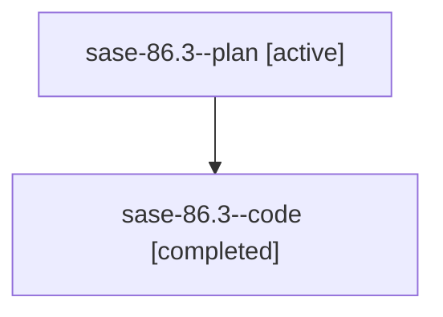

# Family: sase-86.3

[Agent Hoods](../README.md) / [bbugyi200](../users/bbugyi200/README.md) / [athena](../users/bbugyi200/machines/athena/README.md) / [sase-86](../users/bbugyi200/machines/athena/hoods/sase-86/README.md) / sase-86.3

Owner: `bbugyi200.athena` · Hood: `sase-86` · Members: 2

## Lineage

The diagram is an optional enhancement; the ordered table below contains the same lineage in accessible text.

| Role | Agent | State | Model / provider | Timing | Commits | Prompt | Chat |
|---|---|---|---|---|---:|---|---|
| plan | sase-86.3--plan | active | gpt-5.6-sol / codex | 2026-07-20T15:53:32.325404+00:00 | 0 | [Prompt](../agents/bbugyi200.athena.sase-86.3--plan/prompt.md) | [Chat](../agents/bbugyi200.athena.sase-86.3--plan/chat.md) |
| code | sase-86.3--code | completed | gpt-5.6-sol / codex | 2026-07-20T15:56:11.413272+00:00 | [1](../agents/bbugyi200.athena.sase-86.3--code/README.md#commits) | — | [Chat](../agents/bbugyi200.athena.sase-86.3--code/chat.md) |

## Commits

| Role | Repo | Commit | Subject | Committed |
|---|---|---|---|---|
| code | sase | [`a0a09b2`](https://github.com/sase-org/sase/commit/a0a09b22a176d4449acbead9b7b6051efc9c8f81) | perf(test): reduce top-offender suite runtime (sase-86.3) | 2026-07-20 13:20:55 EDT |

## Neighbors

| Agent | Relation | State |
|---|---|---|
| [sase-86.1](bbugyi200.athena.sase-86.1.md) (family · 2) | sase-86 hood | active 1, completed 1 |
| [sase-86.1](../agents/bbugyi200.athena.sase-86.1/README.md) | sase-86 hood | completed |
| [sase-86.2](bbugyi200.athena.sase-86.2.md) (family · 2) | sase-86 hood | active 1, completed 1 |
| [sase-86.2](../agents/bbugyi200.athena.sase-86.2/README.md) | sase-86 hood | completed |
| [sase-86.4](bbugyi200.athena.sase-86.4.md) (family · 2) | sase-86 hood | active 1, completed 1 |
| [sase-86.4](../agents/bbugyi200.athena.sase-86.4/README.md) | sase-86 hood | completed |
| [sase-86.5](../agents/bbugyi200.athena.sase-86.5/README.md) | sase-86 hood | active |
| [sase-86.6](../agents/bbugyi200.athena.sase-86.6/README.md) | sase-86 hood | active |
| [sase-86.land](../agents/bbugyi200.athena.sase-86.land/README.md) | sase-86 hood | active |
