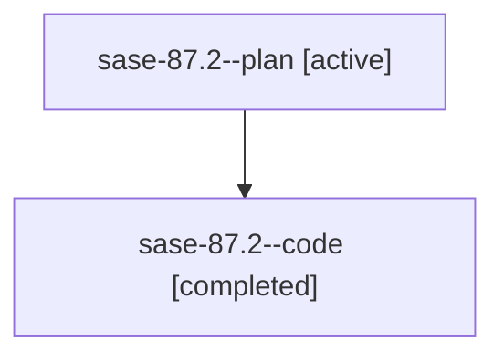

# Family: sase-87.2

[Agent Hoods](../README.md) / [bbugyi200](../users/bbugyi200/README.md) / [athena](../users/bbugyi200/machines/athena/README.md) / [sase-87](../users/bbugyi200/machines/athena/hoods/sase-87/README.md) / sase-87.2

Owner: `bbugyi200.athena` · Hood: `sase-87` · Members: 2

## Lineage

The diagram is an optional enhancement; the ordered table below contains the same lineage in accessible text.

| Role | Agent | State | Model / provider | Timing | Commits | Prompt | Chat |
|---|---|---|---|---|---:|---|---|
| plan | sase-87.2--plan | active | gpt-5.6-sol / codex | 2026-07-20T15:21:44.258697+00:00 | 0 | [Prompt](../agents/bbugyi200.athena.sase-87.2--plan/prompt.md) | [Chat](../agents/bbugyi200.athena.sase-87.2--plan/chat.md) |
| code | sase-87.2--code | completed | gpt-5.6-sol / codex | 2026-07-20T15:24:49.782399+00:00 | [1](../agents/bbugyi200.athena.sase-87.2--code/README.md#commits) | — | [Chat](../agents/bbugyi200.athena.sase-87.2--code/chat.md) |

## Commits

| Role | Commit | Subject | Committed (UTC) |
|---|---|---|---|
| code | [`e6c865e`](https://github.com/sase-org/sase/commit/e6c865e9ab838696545d21e6509a7eb5b7d612bd) | feat(xprompt): support bead waits (sase-87.2) | 2026-07-20 16:01:57 |

## Neighbors

| Agent | Relation | State |
|---|---|---|
| [sase-87.1](bbugyi200.athena.sase-87.1.md) (family · 2) | sase-87 hood | active 1, completed 1 |
| [sase-87.3](bbugyi200.athena.sase-87.3.md) (family · 2) | sase-87 hood | active 1, completed 1 |
| [sase-87.3](../agents/bbugyi200.athena.sase-87.3/README.md) | sase-87 hood | completed |
| [sase-87.4](bbugyi200.athena.sase-87.4.md) (family · 2) | sase-87 hood | active 1, completed 1 |
| [sase-87.4](../agents/bbugyi200.athena.sase-87.4/README.md) | sase-87 hood | completed |
| [sase-87.5](../agents/bbugyi200.athena.sase-87.5/README.md) | sase-87 hood | active |
| [sase-87.6](../agents/bbugyi200.athena.sase-87.6/README.md) | sase-87 hood | active |
| [sase-87.land](../agents/bbugyi200.athena.sase-87.land/README.md) | sase-87 hood | active |
