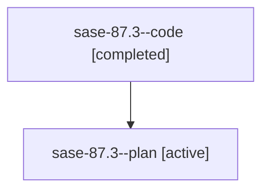

# Family: sase-87.3

Owner: `bbugyi200.athena` · Hood: `sase-87` · Members: 2

## Lineage

The diagram is an optional enhancement; the ordered table below contains the same lineage in accessible text.

| Role | Agent | State | Model / provider | Timing | Commits | Prompt | Chat |
|---|---|---|---|---|---:|---|---|
| code | sase-87.3--code | completed | gpt-5.6-sol / codex | 2026-07-20T16:09:16.083047+00:00 | 1 | — | [Chat](../agents/bbugyi200.athena.sase-87.3--code/chat.md) |
| plan | sase-87.3--plan | active | claude-fable-5 / claude | 2026-07-20T16:02:22.567918+00:00 | 0 | [Prompt](../agents/bbugyi200.athena.sase-87.3--plan/prompt.md) | [Chat](../agents/bbugyi200.athena.sase-87.3--plan/chat.md) |
