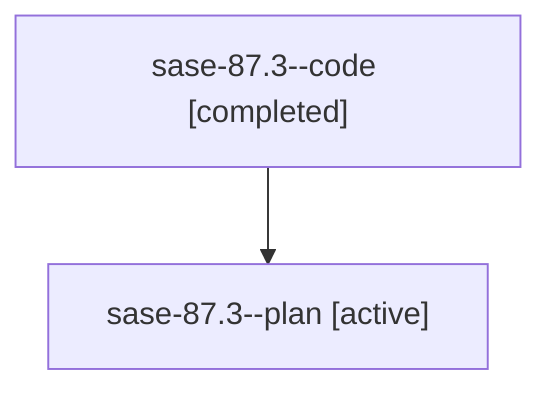

# Family: sase-87.3

[Agent Hoods](../README.md) / [bbugyi200](../users/bbugyi200/README.md) / [athena](../users/bbugyi200/machines/athena/README.md) / [sase-87](../users/bbugyi200/machines/athena/hoods/sase-87/README.md) / sase-87.3

Owner: `bbugyi200.athena` · Hood: `sase-87` · Members: 2 · Bead: [sase-87.3](https://github.com/sase-org/sase--beads/blob/main/pages/sase-87/sase-87.3.md)

## Lineage

The diagram is an optional enhancement; the ordered table below contains the same lineage in accessible text.

| Role | Agent | State | Model / provider | Timing | Commits | Prompt | Chat |
|---|---|---|---|---|---:|---|---|
| code | sase-87.3--code | completed | gpt-5.6-sol / codex | 2026-07-20T16:09:16.083047+00:00 | [1](../agents/bbugyi200.athena.sase-87.3--code/README.md#commits) | — | [Chat](../agents/bbugyi200.athena.sase-87.3--code/chat.md) |
| plan | sase-87.3--plan | active | claude-fable-5 / claude | 2026-07-20T16:02:22.567918+00:00 | 0 | [Prompt](../agents/bbugyi200.athena.sase-87.3--plan/prompt.md) | [Chat](../agents/bbugyi200.athena.sase-87.3--plan/chat.md) |

## Commits

| Role | Repo | Commit | Subject | Committed |
|---|---|---|---|---|
| code | sase | [`a874efc`](https://github.com/sase-org/sase/commit/a874efce376f5886da4795610aed55e24d769c8c) | feat: resolve waits gated by closed beads (sase-87.3) | 2026-07-20 16:40:56 UTC |

## Neighbors

| Agent | Relation | State |
|---|---|---|
| [sase-87.1](bbugyi200.athena.sase-87.1.md) (family · 2) | sase-87 hood | active 1, completed 1 |
| [sase-87.2](bbugyi200.athena.sase-87.2.md) (family · 2) | sase-87 hood | active 1, completed 1 |
| [sase-87.4](bbugyi200.athena.sase-87.4.md) (family · 2) | sase-87 hood | active 1, completed 1 |
| [sase-87.5](../agents/bbugyi200.athena.sase-87.5/README.md) | sase-87 hood | active |
| [sase-87.6](../agents/bbugyi200.athena.sase-87.6/README.md) | sase-87 hood | active |
| [sase-87.land](../agents/bbugyi200.athena.sase-87.land/README.md) | sase-87 hood | active |
