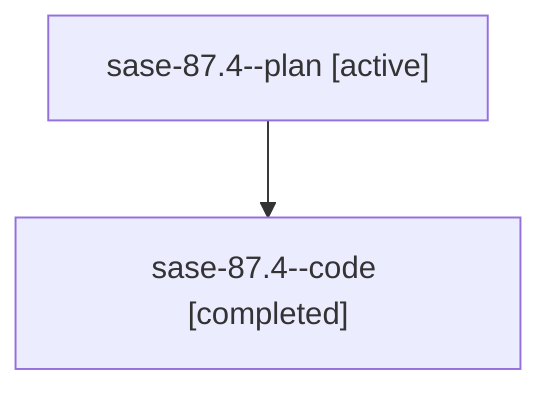

# Family: sase-87.4

[Agent Hoods](../README.md) / [bbugyi200](../users/bbugyi200/README.md) / [athena](../users/bbugyi200/machines/athena/README.md) / [sase-87](../users/bbugyi200/machines/athena/hoods/sase-87/README.md) / sase-87.4

Owner: `bbugyi200.athena` · Hood: `sase-87` · Members: 2 · Bead: [sase-87.4](https://github.com/sase-org/sase--beads/blob/main/pages/sase-87/sase-87.4.md)

## Lineage

The diagram is an optional enhancement; the ordered table below contains the same lineage in accessible text.

| Role | Agent | State | Model / provider | Timing | Commits | Prompt | Chat |
|---|---|---|---|---|---:|---|---|
| plan | sase-87.4--plan | active | gpt-5.6-sol / codex | 2026-07-20T16:02:23.519530+00:00 | 0 | [Prompt](../agents/bbugyi200.athena.sase-87.4--plan/prompt.md) | [Chat](../agents/bbugyi200.athena.sase-87.4--plan/chat.md) |
| code | sase-87.4--code | completed | gpt-5.6-sol / codex | 2026-07-20T16:07:17.902075+00:00 | 0 | — | [Chat](../agents/bbugyi200.athena.sase-87.4--code/chat.md) |

## Commits

| Role | Repo | Commit | Subject | Committed |
|---|---|---|---|---|
| — | sase | [`0ee641f`](https://github.com/sase-org/sase/commit/0ee641f6c047f73870a345f682e484e152321409) | feat(bead): emit bead-gated waits for epic work (sase-87.4) | 2026-07-20 13:19:48 EDT |

## Neighbors

| Agent | Relation | State |
|---|---|---|
| [sase-87.1](bbugyi200.athena.sase-87.1.md) (family · 2) | sase-87 hood | active 1, completed 1 |
| [sase-87.2](bbugyi200.athena.sase-87.2.md) (family · 2) | sase-87 hood | active 1, completed 1 |
| [sase-87.3](bbugyi200.athena.sase-87.3.md) (family · 2) | sase-87 hood | active 1, completed 1 |
| [sase-87.5](../agents/bbugyi200.athena.sase-87.5/README.md) | sase-87 hood | active |
| [sase-87.6](../agents/bbugyi200.athena.sase-87.6/README.md) | sase-87 hood | active |
| [sase-87.land](../agents/bbugyi200.athena.sase-87.land/README.md) | sase-87 hood | active |
