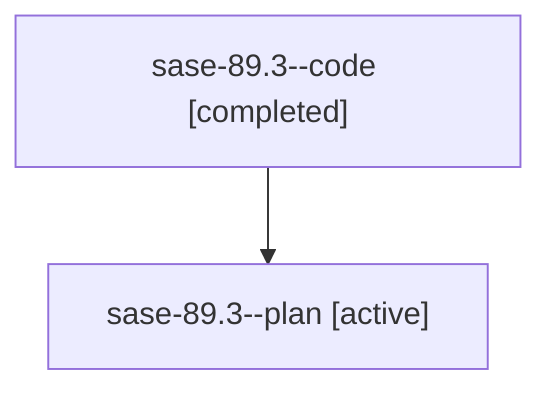

# Family: sase-89.3

[Agent Hoods](../README.md) / [bbugyi200](../users/bbugyi200/README.md) / [athena](../users/bbugyi200/machines/athena/README.md) / [sase-89](../users/bbugyi200/machines/athena/hoods/sase-89/README.md) / sase-89.3

Owner: `bbugyi200.athena` · Hood: `sase-89` · Members: 2 · Bead: [sase-89.3](https://github.com/sase-org/sase--beads/blob/main/pages/sase-89/sase-89.3.md)

## Lineage

The diagram is an optional enhancement; the ordered table below contains the same lineage in accessible text.

| Role | Agent | State | Model / provider | Timing | Commits | Prompt | Chat |
|---|---|---|---|---|---:|---|---|
| code | sase-89.3--code | completed | gpt-5.6-sol / codex | 2026-07-20T17:14:58.296780+00:00 | [1](../agents/bbugyi200.athena.sase-89.3--code/README.md#commits) | — | [Chat](../agents/bbugyi200.athena.sase-89.3--code/chat.md) |
| plan | sase-89.3--plan | active | gpt-5.6-sol / codex | 2026-07-20T17:08:29.536878+00:00 | 0 | [Prompt](../agents/bbugyi200.athena.sase-89.3--plan/prompt.md) | [Chat](../agents/bbugyi200.athena.sase-89.3--plan/chat.md) |

## Commits

| Role | Repo | Commit | Subject | Committed |
|---|---|---|---|---|
| — | sase | [`148bbb1`](https://github.com/sase-org/sase/commit/148bbb1cc982f47100bdeb4ba9acd4e78744d08d) | fix(projects): humanize remaining display surfaces (sase-89.3) | 2026-07-20 13:58:37 EDT |
| code | sase | [`e3af45c`](https://github.com/sase-org/sase/commit/e3af45c7060abb9481e85c2a14c3c99cce74b20a) | fix(stats): retain project display projection helper (sase-89.3) | 2026-07-20 14:01:32 EDT |

## Neighbors

| Agent | Relation | State |
|---|---|---|
| [sase-89.1](bbugyi200.athena.sase-89.1.md) (family · 2) | sase-89 hood | active 1, completed 1 |
| [sase-89.2](bbugyi200.athena.sase-89.2.md) (family · 2) | sase-89 hood | active 1, completed 1 |
| [sase-89.4](bbugyi200.athena.sase-89.4.md) (family · 2) | sase-89 hood | active 1, completed 1 |
| [sase-89.land](../agents/bbugyi200.athena.sase-89.land/README.md) | sase-89 hood | active |
