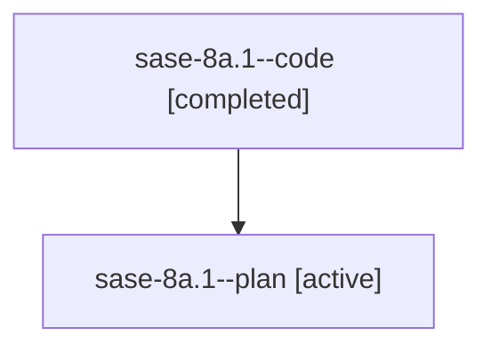

# Family: sase-8a.1

[Agent Hoods](../README.md) / [bbugyi200](../users/bbugyi200/README.md) / [athena](../users/bbugyi200/machines/athena/README.md) / [sase-8a](../users/bbugyi200/machines/athena/hoods/sase-8a/README.md) / sase-8a.1

Owner: `bbugyi200.athena` · Hood: `sase-8a` · Members: 2

## Lineage

The diagram is an optional enhancement; the ordered table below contains the same lineage in accessible text.

| Role | Agent | State | Model / provider | Timing | Commits | Prompt | Chat |
|---|---|---|---|---|---:|---|---|
| code | sase-8a.1--code | completed | gpt-5.6-sol / codex | 2026-07-20T17:50:12.223974+00:00 | [1](../agents/bbugyi200.athena.sase-8a.1--code/README.md#commits) | — | [Chat](../agents/bbugyi200.athena.sase-8a.1--code/chat.md) |
| plan | sase-8a.1--plan | active | gpt-5.6-sol / codex | 2026-07-20T17:46:55.688551+00:00 | 0 | [Prompt](../agents/bbugyi200.athena.sase-8a.1--plan/prompt.md) | [Chat](../agents/bbugyi200.athena.sase-8a.1--plan/chat.md) |

## Commits

| Role | Repo | Commit | Subject | Committed |
|---|---|---|---|---|
| code | sase | [`26ebac8`](https://github.com/sase-org/sase/commit/26ebac8584d0e0778ffa271deb4fd3b36a4b022d) | feat(ace): clarify statistics scope controls (sase-8a.1) | 2026-07-20 14:17:06 EDT |

## Neighbors

| Agent | Relation | State |
|---|---|---|
| [sase-8a.2](bbugyi200.athena.sase-8a.2.md) (family · 2) | sase-8a hood | active 1, completed 1 |
| [sase-8a.2](../agents/bbugyi200.athena.sase-8a.2/README.md) | sase-8a hood | completed |
| [sase-8a.3](bbugyi200.athena.sase-8a.3.md) (family · 1) | sase-8a hood | active 1 |
| [sase-8a.4](../agents/bbugyi200.athena.sase-8a.4/README.md) | sase-8a hood | active |
| [sase-8a.land](bbugyi200.athena.sase-8a.land.md) (family · 2) | sase-8a hood | active 1, completed 1 |
| [sase-8a.land](../agents/bbugyi200.athena.sase-8a.land/README.md) | sase-8a hood | completed |
