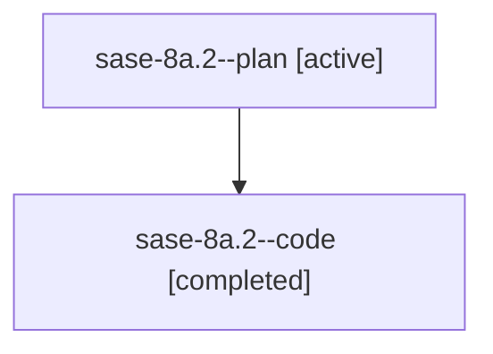

# Family: sase-8a.2

Owner: `bbugyi200.athena` · Hood: `sase-8a` · Members: 2

## Lineage

The diagram is an optional enhancement; the ordered table below contains the same lineage in accessible text.

| Role | Agent | State | Model / provider | Timing | Commits | Prompt | Chat |
|---|---|---|---|---|---:|---|---|
| plan | sase-8a.2--plan | active | gpt-5.6-sol / codex | 2026-07-20T18:17:50.762175+00:00 | 0 | [Prompt](../agents/bbugyi200.athena.sase-8a.2--plan/prompt.md) | [Chat](../agents/bbugyi200.athena.sase-8a.2--plan/chat.md) |
| code | sase-8a.2--code | completed | gpt-5.6-sol / codex | 2026-07-20T18:22:32.878708+00:00 | 1 | — | [Chat](../agents/bbugyi200.athena.sase-8a.2--code/chat.md) |
