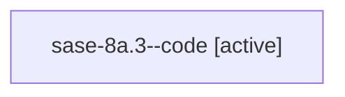

# Family: sase-8a.3

[Agent Hoods](../README.md) / [bbugyi200](../users/bbugyi200/README.md) / [athena](../users/bbugyi200/machines/athena/README.md) / [sase-8a](../users/bbugyi200/machines/athena/hoods/sase-8a/README.md) / sase-8a.3

Owner: `bbugyi200.athena` · Hood: `sase-8a` · Members: 1

## Lineage

The diagram is an optional enhancement; the ordered table below contains the same lineage in accessible text.

| Role | Agent | State | Model / provider | Timing | Commits | Prompt | Chat |
|---|---|---|---|---|---:|---|---|
| code | sase-8a.3--code | active | gpt-5.6-sol / codex | 2026-07-20T18:53:39.895311+00:00 | 0 | — | — |

## Neighbors

| Agent | Relation | State |
|---|---|---|
| [sase-8a.1](bbugyi200.athena.sase-8a.1.md) (family · 2) | sase-8a hood | active 1, completed 1 |
| [sase-8a.1](../agents/bbugyi200.athena.sase-8a.1/README.md) | sase-8a hood | completed |
| [sase-8a.2](bbugyi200.athena.sase-8a.2.md) (family · 2) | sase-8a hood | active 1, completed 1 |
| [sase-8a.2](../agents/bbugyi200.athena.sase-8a.2/README.md) | sase-8a hood | completed |
| [sase-8a.4](../agents/bbugyi200.athena.sase-8a.4/README.md) | sase-8a hood | active |
| [sase-8a.land](bbugyi200.athena.sase-8a.land.md) (family · 2) | sase-8a hood | active 1, completed 1 |
| [sase-8a.land](../agents/bbugyi200.athena.sase-8a.land/README.md) | sase-8a hood | completed |
