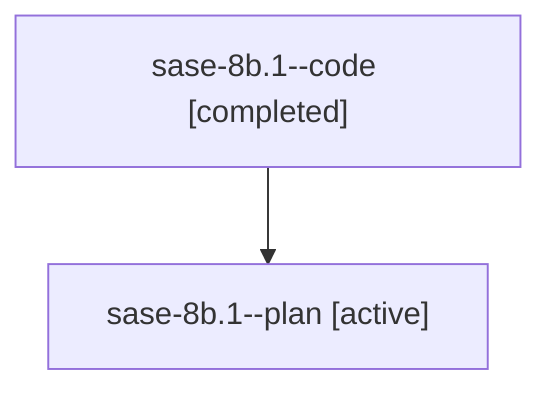

# Family: sase-8b.1

[Agent Hoods](../README.md) / [bbugyi200](../users/bbugyi200/README.md) / [athena](../users/bbugyi200/machines/athena/README.md) / [sase-8b](../users/bbugyi200/machines/athena/hoods/sase-8b/README.md) / sase-8b.1

Owner: `bbugyi200.athena` · Hood: `sase-8b` · Members: 2 · Bead: [sase-8b.1](https://github.com/sase-org/sase--beads/blob/main/pages/sase-8b/sase-8b.1.md)

## Lineage

The diagram is an optional enhancement; the ordered table below contains the same lineage in accessible text.

| Role | Agent | State | Model / provider | Timing | Commits | Prompt | Chat |
|---|---|---|---|---|---:|---|---|
| code | sase-8b.1--code | completed | gpt-5.6-sol / codex | 2026-07-20T18:11:43.809715+00:00 | [1](../agents/bbugyi200.athena.sase-8b.1--code/README.md#commits) | — | [Chat](../agents/bbugyi200.athena.sase-8b.1--code/chat.md) |
| plan | sase-8b.1--plan | active | gpt-5.6-sol / codex | 2026-07-20T18:08:23.962333+00:00 | 0 | [Prompt](../agents/bbugyi200.athena.sase-8b.1--plan/prompt.md) | [Chat](../agents/bbugyi200.athena.sase-8b.1--plan/chat.md) |

## Commits

| Role | Repo | Commit | Subject | Committed |
|---|---|---|---|---|
| code | sase | [`00dd055`](https://github.com/sase-org/sase/commit/00dd055778bb153d2abbe622118413547f0e8969) | feat(ace): show normalized epic phase sizes (sase-8b.1) | 2026-07-20 18:43:35 UTC |

## Neighbors

| Agent | Relation | State |
|---|---|---|
| [sase-8b.2](bbugyi200.athena.sase-8b.2.md) (family · 1) | sase-8b hood | active 1 |
| [sase-8b.3](bbugyi200.athena.sase-8b.3.md) (family · 2) | sase-8b hood | active 1, completed 1 |
| [sase-8b.4](../agents/bbugyi200.athena.sase-8b.4/README.md) | sase-8b hood | active |
| [sase-8b.land](../agents/bbugyi200.athena.sase-8b.land/README.md) | sase-8b hood | active |
