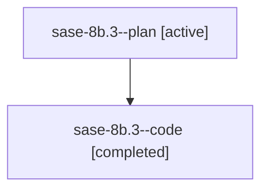

# Family: sase-8b.3

[Agent Hoods](../README.md) / [bbugyi200](../users/bbugyi200/README.md) / [athena](../users/bbugyi200/machines/athena/README.md) / [sase-8b](../users/bbugyi200/machines/athena/hoods/sase-8b/README.md) / sase-8b.3

Owner: `bbugyi200.athena` · Hood: `sase-8b` · Members: 2

## Lineage

The diagram is an optional enhancement; the ordered table below contains the same lineage in accessible text.

| Role | Agent | State | Model / provider | Timing | Commits | Prompt | Chat |
|---|---|---|---|---|---:|---|---|
| plan | sase-8b.3--plan | active | gpt-5.6-sol / codex | 2026-07-20T18:44:03.599127+00:00 | 0 | [Prompt](../agents/bbugyi200.athena.sase-8b.3--plan/prompt.md) | [Chat](../agents/bbugyi200.athena.sase-8b.3--plan/chat.md) |
| code | sase-8b.3--code | completed | gpt-5.6-sol / codex | 2026-07-20T18:47:03.790441+00:00 | 0 | — | [Chat](../agents/bbugyi200.athena.sase-8b.3--code/chat.md) |

## Neighbors

| Agent | Relation | State |
|---|---|---|
| [sase-8b.1](bbugyi200.athena.sase-8b.1.md) (family · 2) | sase-8b hood | active 1, completed 1 |
| [sase-8b.2](bbugyi200.athena.sase-8b.2.md) (family · 1) | sase-8b hood | active 1 |
| [sase-8b.4](../agents/bbugyi200.athena.sase-8b.4/README.md) | sase-8b hood | active |
| [sase-8b.land](../agents/bbugyi200.athena.sase-8b.land/README.md) | sase-8b hood | active |
