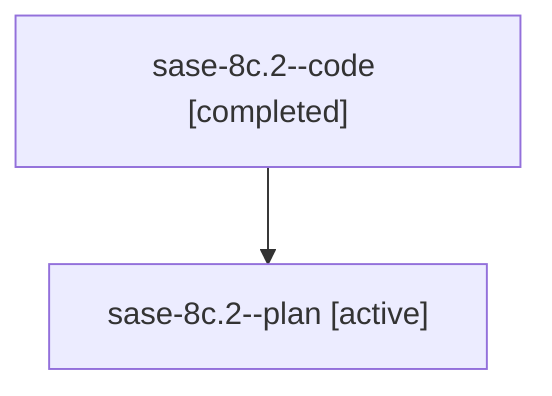

# Family: sase-8c.2

[Agent Hoods](../README.md) / [bbugyi200](../users/bbugyi200/README.md) / [athena](../users/bbugyi200/machines/athena/README.md) / [sase-8c](../users/bbugyi200/machines/athena/hoods/sase-8c/README.md) / sase-8c.2

Owner: `bbugyi200.athena` · Hood: `sase-8c` · Members: 2

## Lineage

The diagram is an optional enhancement; the ordered table below contains the same lineage in accessible text.

| Role | Agent | State | Model / provider | Timing | Commits | Prompt | Chat |
|---|---|---|---|---|---:|---|---|
| code | sase-8c.2--code | completed | gpt-5.6-sol / codex | 2026-07-20T18:23:56.109833+00:00 | [1](../agents/bbugyi200.athena.sase-8c.2--code/README.md#commits) | — | [Chat](../agents/bbugyi200.athena.sase-8c.2--code/chat.md) |
| plan | sase-8c.2--plan | active | gpt-5.6-sol / codex | 2026-07-20T18:20:34.094050+00:00 | 0 | [Prompt](../agents/bbugyi200.athena.sase-8c.2--plan/prompt.md) | [Chat](../agents/bbugyi200.athena.sase-8c.2--plan/chat.md) |

## Commits

| Role | Commit | Subject | Committed (UTC) |
|---|---|---|---|
| code | [`46c2f06`](https://github.com/sase-org/sase/commit/46c2f0622a4998cf01e997a147df5c600ee1bae7) | feat: prioritize runner-slot wait admission (sase-8c.2) | 2026-07-20 18:49:41 |

## Neighbors

| Agent | Relation | State |
|---|---|---|
| [sase-8c.1](../agents/bbugyi200.athena.sase-8c.1/README.md) | sase-8c hood | active |
| [sase-8c.3](../agents/bbugyi200.athena.sase-8c.3/README.md) | sase-8c hood | active |
| [sase-8c.land](../agents/bbugyi200.athena.sase-8c.land/README.md) | sase-8c hood | active |
