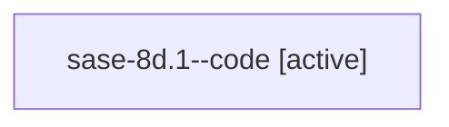

# Family: sase-8d.1

[Agent Hoods](../README.md) / [bbugyi200](../users/bbugyi200/README.md) / [athena](../users/bbugyi200/machines/athena/README.md) / [sase-8d](../users/bbugyi200/machines/athena/hoods/sase-8d/README.md) / sase-8d.1

Owner: `bbugyi200.athena` · Hood: `sase-8d` · Members: 1 · Bead: [sase-8d.1](https://github.com/sase-org/sase--beads/blob/main/pages/sase-8d/sase-8d.1.md)

## Lineage

The diagram is an optional enhancement; the ordered table below contains the same lineage in accessible text.

| Role | Agent | State | Model / provider | Timing | Commits | Prompt | Chat |
|---|---|---|---|---|---:|---|---|
| code | sase-8d.1--code | active | gpt-5.6-sol / codex | 2026-07-20T18:43:46.061152+00:00 | 0 | — | — |

## Neighbors

| Agent | Relation | State |
|---|---|---|
| [sase-8d.2](bbugyi200.athena.sase-8d.2.md) (family · 2) | sase-8d hood | active 1, completed 1 |
| [sase-8d.3](bbugyi200.athena.sase-8d.3.md) (family · 2) | sase-8d hood | active 1, completed 1 |
| [sase-8d.land](bbugyi200.athena.sase-8d.land.md) (family · 2) | sase-8d hood | active 1, completed 1 |
