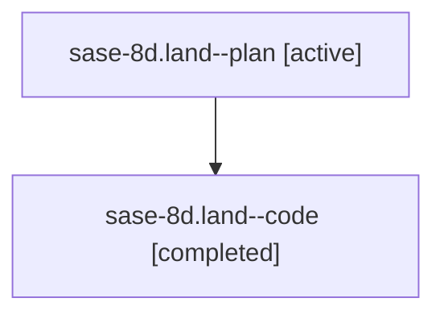

# Family: sase-8d.land

[Agent Hoods](../README.md) / [bbugyi200](../users/bbugyi200/README.md) / [athena](../users/bbugyi200/machines/athena/README.md) / [sase-8d](../users/bbugyi200/machines/athena/hoods/sase-8d/README.md) / sase-8d.land

Owner: `bbugyi200.athena` · Hood: `sase-8d` · Members: 2 · Bead: [sase-8d](https://github.com/sase-org/sase--beads/blob/main/pages/sase-8d/README.md)

## Lineage

The diagram is an optional enhancement; the ordered table below contains the same lineage in accessible text.

| Role | Agent | State | Model / provider | Timing | Commits | Prompt | Chat |
|---|---|---|---|---|---:|---|---|
| plan | sase-8d.land--plan | active | gpt-5.6-sol / codex | 2026-07-20T21:04:59.512808+00:00 | 0 | [Prompt](../agents/bbugyi200.athena.sase-8d.land--plan/prompt.md) | [Chat](../agents/bbugyi200.athena.sase-8d.land--plan/chat.md) |
| code | sase-8d.land--code | completed | gpt-5.6-sol / codex | 2026-07-20T21:12:25.674222+00:00 | [1](../agents/bbugyi200.athena.sase-8d.land--code/README.md#commits) | — | [Chat](../agents/bbugyi200.athena.sase-8d.land--code/chat.md) |

## Commits

| Role | Repo | Commit | Subject | Committed |
|---|---|---|---|---|
| code | sase | [`fc1c918`](https://github.com/sase-org/sase/commit/fc1c91844a8e4b1c0ad311c98d29f9c3beb61ecc) | fix(sdd): preserve plan path basenames when wrapping (sase-8d) | 2026-07-20 17:27:15 EDT |

## Neighbors

| Agent | Relation | State |
|---|---|---|
| [sase-8d.1](bbugyi200.athena.sase-8d.1.md) (family · 1) | sase-8d hood | active 1 |
| [sase-8d.2](bbugyi200.athena.sase-8d.2.md) (family · 2) | sase-8d hood | active 1, completed 1 |
| [sase-8d.3](bbugyi200.athena.sase-8d.3.md) (family · 2) | sase-8d hood | active 1, completed 1 |
