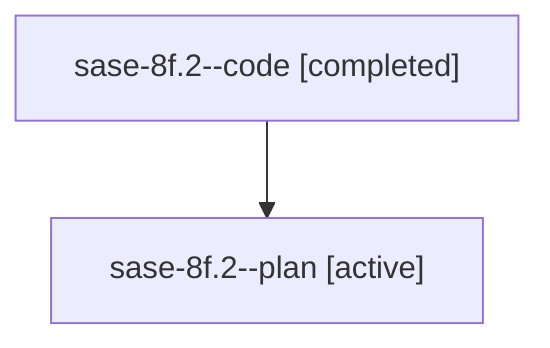

# Family: sase-8f.2

[Agent Hoods](../README.md) / [bbugyi200](../users/bbugyi200/README.md) / [athena](../users/bbugyi200/machines/athena/README.md) / [sase-8f](../users/bbugyi200/machines/athena/hoods/sase-8f/README.md) / sase-8f.2

Owner: `bbugyi200.athena` · Hood: `sase-8f` · Members: 2

## Lineage

The diagram is an optional enhancement; the ordered table below contains the same lineage in accessible text.

| Role | Agent | State | Model / provider | Timing | Commits | Prompt | Chat |
|---|---|---|---|---|---:|---|---|
| code | sase-8f.2--code | completed | gpt-5.6-sol / codex | 2026-07-20T20:27:56.843531+00:00 | [1](../agents/bbugyi200.athena.sase-8f.2--code/README.md#commits) | — | [Chat](../agents/bbugyi200.athena.sase-8f.2--code/chat.md) |
| plan | sase-8f.2--plan | active | gpt-5.6-sol / codex | 2026-07-20T20:22:21.117603+00:00 | 0 | [Prompt](../agents/bbugyi200.athena.sase-8f.2--plan/prompt.md) | [Chat](../agents/bbugyi200.athena.sase-8f.2--plan/chat.md) |

## Commits

| Role | Repo | Commit | Subject | Committed |
|---|---|---|---|---|
| code | sase | [`b935b74`](https://github.com/sase-org/sase/commit/b935b7495d3b297b376370a5ef7bf9f9db9cdc92) | feat(agent): claim beads at launch execution (sase-8f.2) | 2026-07-20 17:04:38 EDT |

## Neighbors

| Agent | Relation | State |
|---|---|---|
| [sase-8f.1](bbugyi200.athena.sase-8f.1.md) (family · 2) | sase-8f hood | active 1, completed 1 |
| [sase-8f.1](../agents/bbugyi200.athena.sase-8f.1/README.md) | sase-8f hood | completed |
| [sase-8f.3](bbugyi200.athena.sase-8f.3.md) (family · 2) | sase-8f hood | active 1, completed 1 |
| [sase-8f.3](../agents/bbugyi200.athena.sase-8f.3/README.md) | sase-8f hood | completed |
| [sase-8f.land](../agents/bbugyi200.athena.sase-8f.land/README.md) | sase-8f hood | active |
