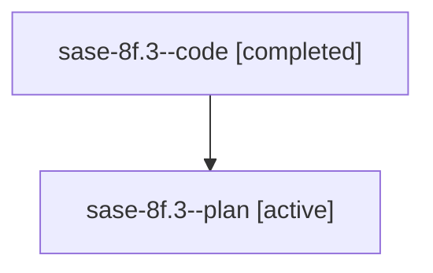

# Family: sase-8f.3

[Agent Hoods](../README.md) / [bbugyi200](../users/bbugyi200/README.md) / [athena](../users/bbugyi200/machines/athena/README.md) / [sase-8f](../users/bbugyi200/machines/athena/hoods/sase-8f/README.md) / sase-8f.3

Owner: `bbugyi200.athena` · Hood: `sase-8f` · Members: 2

## Lineage

The diagram is an optional enhancement; the ordered table below contains the same lineage in accessible text.

| Role | Agent | State | Model / provider | Timing | Commits | Prompt | Chat |
|---|---|---|---|---|---:|---|---|
| code | sase-8f.3--code | completed | gpt-5.6-sol / codex | 2026-07-20T21:09:31.275294+00:00 | [1](../agents/bbugyi200.athena.sase-8f.3--code/README.md#commits) | — | [Chat](../agents/bbugyi200.athena.sase-8f.3--code/chat.md) |
| plan | sase-8f.3--plan | active | gpt-5.6-sol / codex | 2026-07-20T21:05:48.418177+00:00 | 0 | [Prompt](../agents/bbugyi200.athena.sase-8f.3--plan/prompt.md) | [Chat](../agents/bbugyi200.athena.sase-8f.3--plan/chat.md) |

## Commits

| Role | Repo | Commit | Subject | Committed |
|---|---|---|---|---|
| code | sase | [`9d8b7e2`](https://github.com/sase-org/sase/commit/9d8b7e28054ef02f3bece5813fd337627144b0b2) | feat(beads): claim epic work just in time (sase-8f.3) | 2026-07-20 17:34:51 EDT |

## Neighbors

| Agent | Relation | State |
|---|---|---|
| [sase-8f.1](bbugyi200.athena.sase-8f.1.md) (family · 2) | sase-8f hood | active 1, completed 1 |
| [sase-8f.2](bbugyi200.athena.sase-8f.2.md) (family · 2) | sase-8f hood | active 1, completed 1 |
| [sase-8f.land](../agents/bbugyi200.athena.sase-8f.land/README.md) | sase-8f hood | active |
