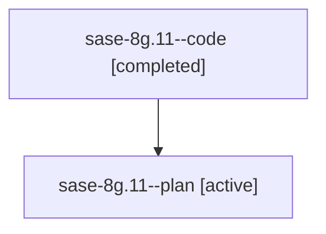

# Family: sase-8g.11

[Agent Hoods](../README.md) / [bbugyi200](../users/bbugyi200/README.md) / [athena](../users/bbugyi200/machines/athena/README.md) / [sase-8g](../users/bbugyi200/machines/athena/hoods/sase-8g/README.md) / sase-8g.11

Owner: `bbugyi200.athena` · Hood: `sase-8g` · Members: 2 · Bead: [sase-8g.11](https://github.com/sase-org/sase--beads/blob/main/pages/sase-8g/sase-8g.11.md)

## Lineage

The diagram is an optional enhancement; the ordered table below contains the same lineage in accessible text.

| Role | Agent | State | Model / provider | Timing | Commits | Prompt | Chat |
|---|---|---|---|---|---:|---|---|
| code | sase-8g.11--code | completed | gpt-5.6-sol / codex | 2026-07-20T21:07:56.491236+00:00 | 0 | — | [Chat](../agents/bbugyi200.athena.sase-8g.11--code/chat.md) |
| plan | sase-8g.11--plan | active | gpt-5.6-sol / codex | 2026-07-20T21:01:43.939703+00:00 | 0 | [Prompt](../agents/bbugyi200.athena.sase-8g.11--plan/prompt.md) | [Chat](../agents/bbugyi200.athena.sase-8g.11--plan/chat.md) |

## Commits

| Role | Repo | Commit | Subject | Committed |
|---|---|---|---|---|
| — | sase | [`866aea6`](https://github.com/sase-org/sase/commit/866aea65a3fc91224db3382125e71fd3494bcd70) | feat(telemetry): isolate test state and add cleanup command (sase-8g.11) | 2026-07-20 17:41:49 EDT |

## Neighbors

| Agent | Relation | State |
|---|---|---|
| [sase-8g.1](bbugyi200.athena.sase-8g.1.md) (family · 2) | sase-8g hood | active 1, completed 1 |
| [sase-8g.10](bbugyi200.athena.sase-8g.10.md) (family · 2) | sase-8g hood | active 1, completed 1 |
| [sase-8g.2](bbugyi200.athena.sase-8g.2.md) (family · 2) | sase-8g hood | active 1, completed 1 |
| [sase-8g.3](bbugyi200.athena.sase-8g.3.md) (family · 2) | sase-8g hood | active 1, completed 1 |
| [sase-8g.4](../agents/bbugyi200.athena.sase-8g.4/README.md) | sase-8g hood | active |
| [sase-8g.5](bbugyi200.athena.sase-8g.5.md) (family · 2) | sase-8g hood | active 1, completed 1 |
| [sase-8g.6](bbugyi200.athena.sase-8g.6.md) (family · 2) | sase-8g hood | active 1, completed 1 |
| [sase-8g.7](bbugyi200.athena.sase-8g.7.md) (family · 2) | sase-8g hood | active 1, completed 1 |
| [sase-8g.8](bbugyi200.athena.sase-8g.8.md) (family · 2) | sase-8g hood | active 1, completed 1 |
| [sase-8g.9](../agents/bbugyi200.athena.sase-8g.9/README.md) | sase-8g hood | active |
| [sase-8g.land](../agents/bbugyi200.athena.sase-8g.land/README.md) | sase-8g hood | active |
