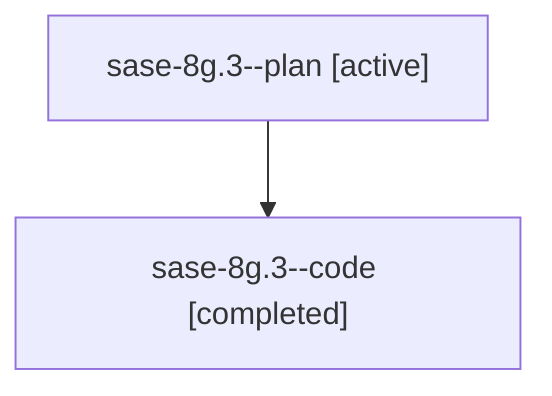

# Family: sase-8g.3

[Agent Hoods](../README.md) / [bbugyi200](../users/bbugyi200/README.md) / [athena](../users/bbugyi200/machines/athena/README.md) / [sase-8g](../users/bbugyi200/machines/athena/hoods/sase-8g/README.md) / sase-8g.3

Owner: `bbugyi200.athena` · Hood: `sase-8g` · Members: 2

## Lineage

The diagram is an optional enhancement; the ordered table below contains the same lineage in accessible text.

| Role | Agent | State | Model / provider | Timing | Commits | Prompt | Chat |
|---|---|---|---|---|---:|---|---|
| plan | sase-8g.3--plan | active | gpt-5.6-sol / codex | 2026-07-20T20:32:07.363522+00:00 | 0 | [Prompt](../agents/bbugyi200.athena.sase-8g.3--plan/prompt.md) | [Chat](../agents/bbugyi200.athena.sase-8g.3--plan/chat.md) |
| code | sase-8g.3--code | completed | gpt-5.6-sol / codex | 2026-07-20T20:37:35.049256+00:00 | [1](../agents/bbugyi200.athena.sase-8g.3--code/README.md#commits) | — | [Chat](../agents/bbugyi200.athena.sase-8g.3--code/chat.md) |

## Commits

| Role | Commit | Subject | Committed (UTC) |
|---|---|---|---|
| code | [`9aed7d7`](https://github.com/sase-org/sase/commit/9aed7d72366ab5bbf243320fb3c621be21d6eea3) | fix(runner-slots): preserve waiter state across admission (sase-8g.3) | 2026-07-20 21:01:23 |

## Neighbors

| Agent | Relation | State |
|---|---|---|
| [sase-8g.1](bbugyi200.athena.sase-8g.1.md) (family · 2) | sase-8g hood | active 1, completed 1 |
| [sase-8g.1](../agents/bbugyi200.athena.sase-8g.1/README.md) | sase-8g hood | completed |
| [sase-8g.10](bbugyi200.athena.sase-8g.10.md) (family · 2) | sase-8g hood | active 1, completed 1 |
| [sase-8g.10](../agents/bbugyi200.athena.sase-8g.10/README.md) | sase-8g hood | completed |
| [sase-8g.11](bbugyi200.athena.sase-8g.11.md) (family · 2) | sase-8g hood | active 1, completed 1 |
| [sase-8g.11](../agents/bbugyi200.athena.sase-8g.11/README.md) | sase-8g hood | completed |
| [sase-8g.2](bbugyi200.athena.sase-8g.2.md) (family · 2) | sase-8g hood | active 1, completed 1 |
| [sase-8g.2](../agents/bbugyi200.athena.sase-8g.2/README.md) | sase-8g hood | completed |
| [sase-8g.4](../agents/bbugyi200.athena.sase-8g.4/README.md) | sase-8g hood | active |
| [sase-8g.5](bbugyi200.athena.sase-8g.5.md) (family · 2) | sase-8g hood | active 1, completed 1 |
| [sase-8g.5](../agents/bbugyi200.athena.sase-8g.5/README.md) | sase-8g hood | completed |
| [sase-8g.6](bbugyi200.athena.sase-8g.6.md) (family · 2) | sase-8g hood | active 1, completed 1 |
| [sase-8g.6](../agents/bbugyi200.athena.sase-8g.6/README.md) | sase-8g hood | completed |
| [sase-8g.7](bbugyi200.athena.sase-8g.7.md) (family · 2) | sase-8g hood | active 1, completed 1 |
| [sase-8g.7](../agents/bbugyi200.athena.sase-8g.7/README.md) | sase-8g hood | completed |
| [sase-8g.8](bbugyi200.athena.sase-8g.8.md) (family · 2) | sase-8g hood | active 1, completed 1 |
| [sase-8g.8](../agents/bbugyi200.athena.sase-8g.8/README.md) | sase-8g hood | completed |
| [sase-8g.9](../agents/bbugyi200.athena.sase-8g.9/README.md) | sase-8g hood | active |
| [sase-8g.land](../agents/bbugyi200.athena.sase-8g.land/README.md) | sase-8g hood | active |
